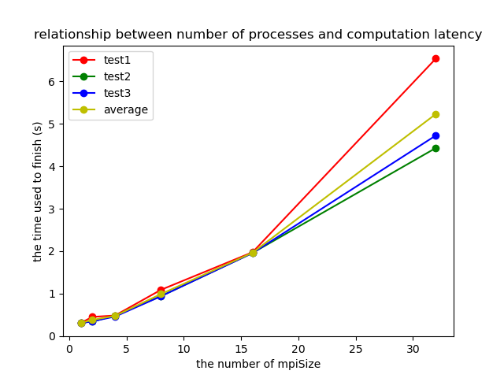
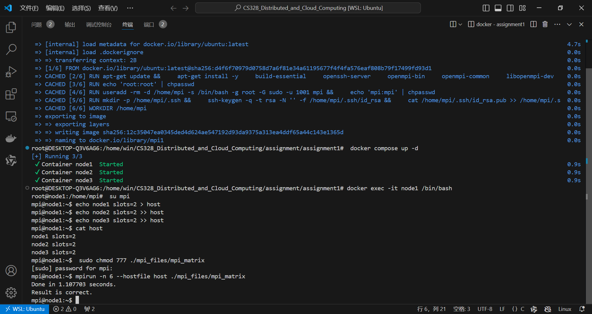
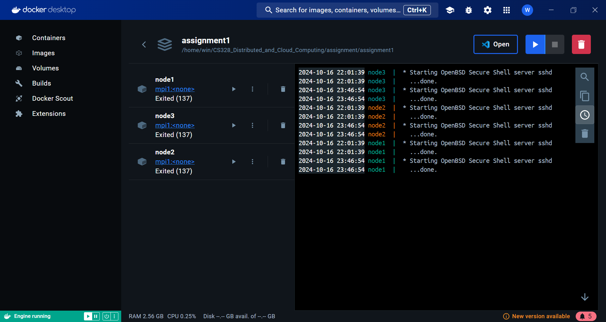
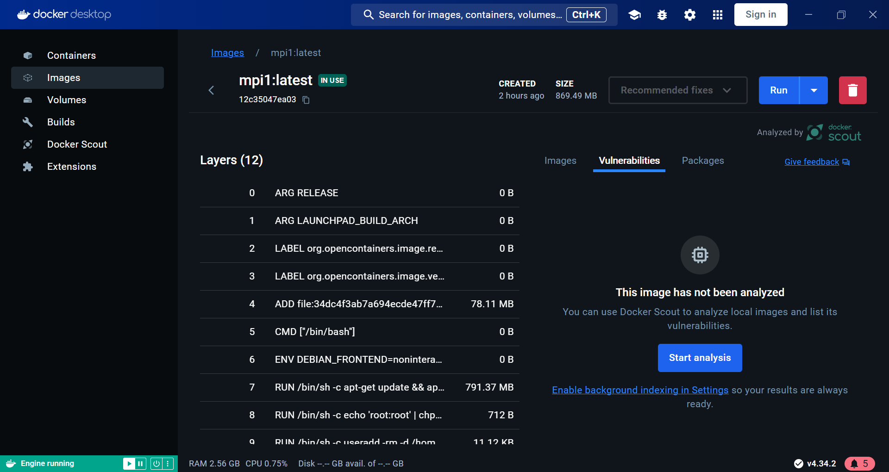
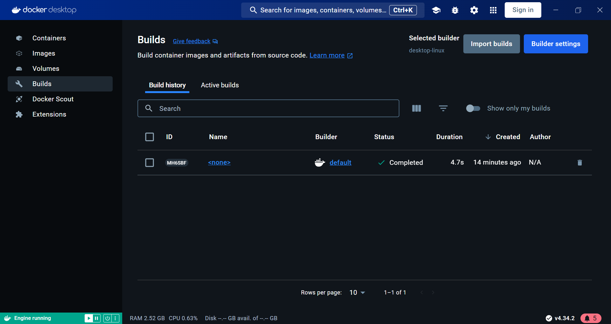

# DISTRIBUTED SYSTEMS ASSIGNMENT REPORT

<div align="center">


**ASSIGNMENT REPORT**

**Assignment ID: Assignment1 - Parallel Matrix Multiplication**
</div>

**Student Name: 王谦益**

**Student ID: 12111003**

## DESIGN

- *Module design: structure block - flow chart and description*
  - **Main Modules**
    - **Matrix Initialization and Output:**
      - Functions to print 1D and 2D arrays, like `outputArr_1d`, `outputArr_2d`, `ouputInfo`.

    - **Matrix Multiplication:**
      - `brute_force_matmul` handles matrix multiplication.

    - **MPI Communication:**
      - Uses `MPI_Scatterv`, `MPI_Bcast`, `MPI_Gatherv` to split work across processes and gather results.

    - **Result Comparison:**
      - The result is compared with brute force multiplication for validation.

  - **Steps**
    1. **Initialization:** Process 0 initializes matrices.
    2. **Scatter Operation:** Matrices are divided among processes.
    3. **Broadcast:** Matrix B is broadcasted to all processes.
    4. **Computation:** Each process computes its portion.
    5. **Gather Operation:** Results are gathered at the root process.
    6. **Validation:** Compare with brute force result.
    7. **Finalization:** MPI finalizes the execution.

- *Class design: UML class diagram and description*

  This is a procedural program, so there are no classes. But, conceptually:

  - **Matrix Class**
    - Attributes: `size`, `data[]`.
    - Methods: `outputArr_1d()`, `outputArr_2d()`, `multiply()`.

  - **MPI_Manager Class**
    - Attributes: `rank`, `world_size`.
    - Methods: `MPI_Scatterv()`, `MPI_Gatherv()`, `MPI_Finalize()`.

## RUNNING RESULT


- use different matrix size to test the performance, and the time cost increases as the matrix size increases.



- run the program for three times to get the average time cost, and the result shows that the time cost decreases as the number of processes increases.



- setup 3 docker container with 2 slots in each and run the program in docker container.





- Some screenshots of the docker from docker desktop.

## PROBLEMS

- *Problems and Solutions*
  - Segmentation fault
    - when I run the program with MAT_SIZE > 300, I got a segmentation fault.

    - ```text
      -------------------------------------------------------
      Primary job  terminated normally, but 1 process 
      returned a non-zero exit code. Per user-direction,
      the job has been aborted.
      -------------------------------------------------------
      -------------------------------------------------------
      mpirun noticed that process rank 0 with PID 0 on
      node DESKTOP-Q3V6AG6 exited on signal 11 (Segmentation
      fault).
      -------------------------------------------------------
      ```

    - The problem is caused by the memory overflow. There are too many arrays used in the program, which leads to the memory overflow, especially when the matrix size is large.
    - To solve this problem, I deleted some useless arrays and use `malloc()` and `free()` to decrease the memory usage.
