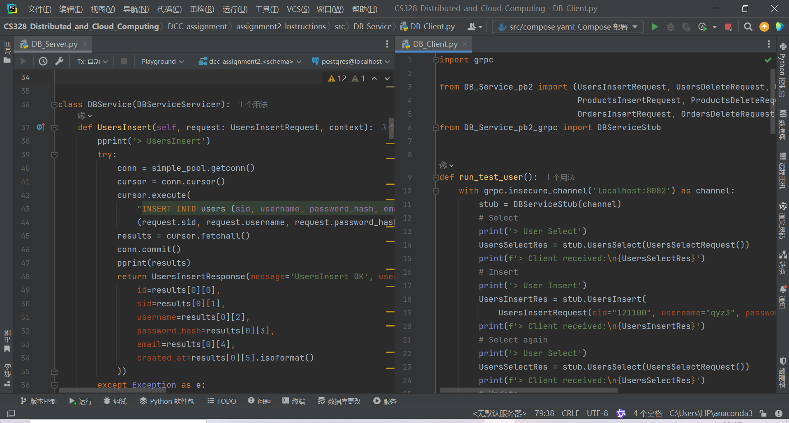
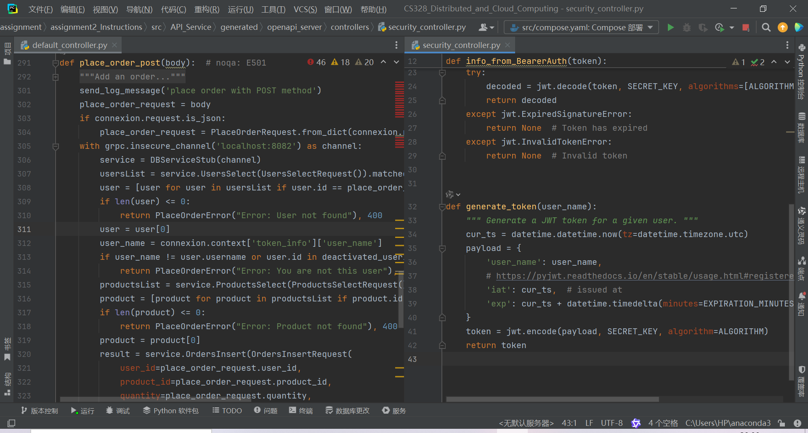
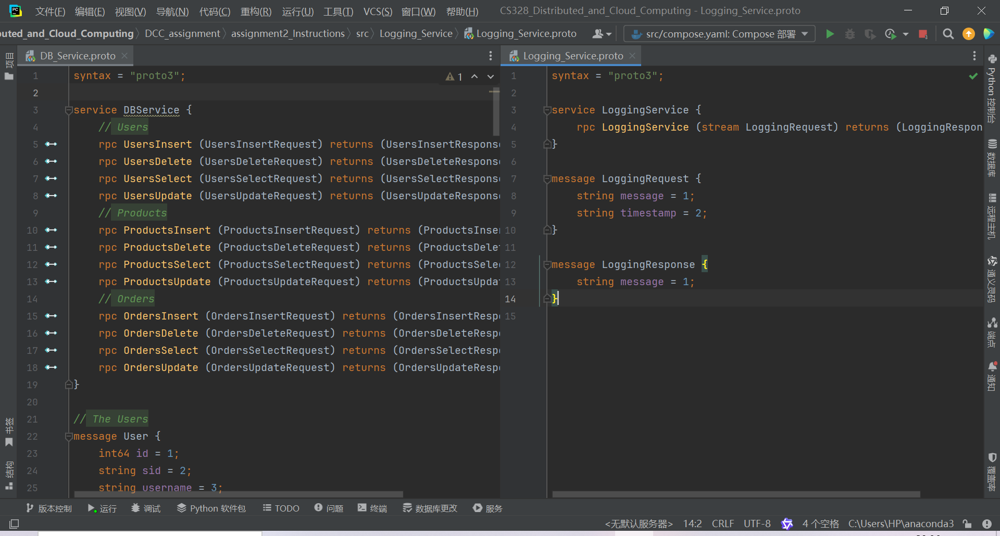
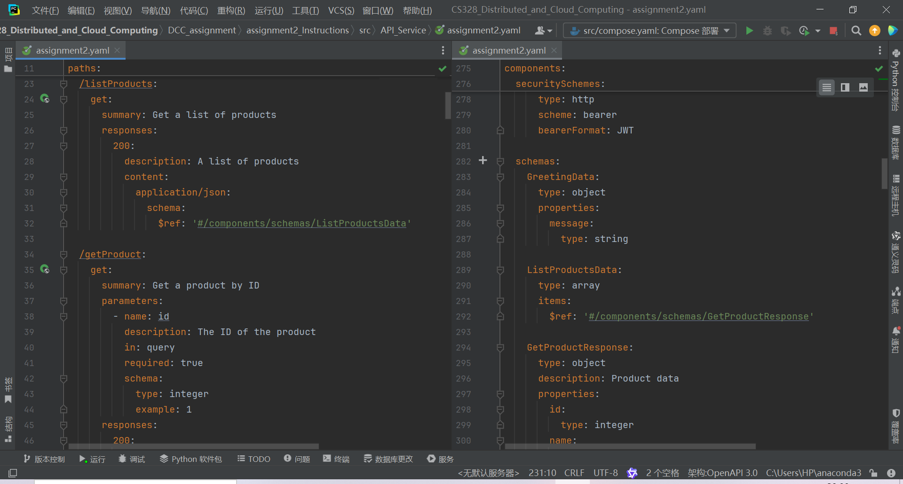
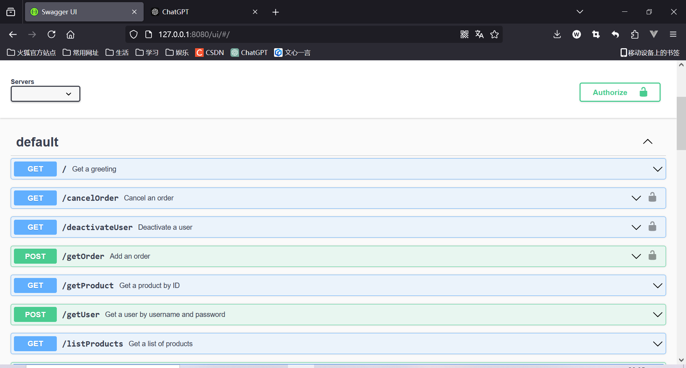
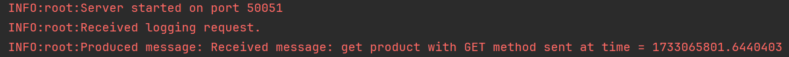
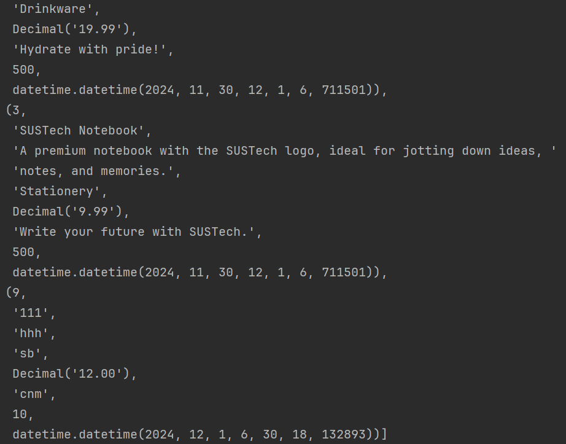

# DISTRIBUTED SYSTEMS ASSIGNMENT REPORT

<div align="center">


**ASSIGNMENT REPORT**

**Assignment ID: Assignment2 - SUSTech Merch Store**
</div>

**Student Name: 王谦益**

**Student ID: 12111003**

## DESIGN

- **DB Service**
  - *init.sql*
  - *DB_Service.proto*
    - three message to difine Users, Products and Orders.
    - Insert, Delete, Select, ans Update for Users, Products and Orders.
  - *DB_Service_pb2.py*, *DB_Service_pb2.pyi*, *DB_Service_pb2_grpc.py*
  - *DB_Service.py*: DBService implement all the functions.
  - *DB_Client.py*: test DBService's functions.
  
  
- **Logging Server**
  - *Logging_Service.proto*
    - two message to difine Logs.
  - *Logging_Service_pb2.py*, *Logging_Service_pb2.pyi*, *Logging_Service_pb2_grpc.py*
  - *Logging_Service.py*: LoggingService implement all the functions.
  - *Logging_Client.py*: test LoggingService's functions.
- **API Server**
  - *assignment2.yaml*: 12 paths provided.
    - A Greeting API that returns a welcome message at the base URL
    - list-products and get-product operations for products
    - register, deactivate-user, get-user, update-user, login for users
    - place-order, cancel-order, get-order for orders
  - *genetated openAPI: openapi_server*
    - security_controller.py: info_from_BearerAuth & generate_token
    - default_controller.py: 12 APIs provided to get data & 1 function to send log message.

  

## QUESTIONS IN PDF

### 1. IMPLEMENTATION

- **DB Service**
  1. write `DB_Service.proto` and set response type & request type for each CRUD operations for users, products and orders.
  2. run command to generate `DB_Service_pb2.py`, `DB_Service_pb2.pyi`, `DB_Service_pb2_grpc.py`.
  3. write `DB_Service.py` to implement all the CRUD functions with exception handling.
  4. write `DB_Client.py` to test DBService's functions.



- **Logging Server**
  1. write `Logging_Service.proto` and set response type & request type for logs.
  2. run command to generate `Logging_Service_pb2.py`, `Logging_Service_pb2.pyi`, `Logging_Service_pb2_grpc.py`.
  3. write `Logging_Service.py` to implement aynsc function to send log message to the logging server.
  4. write `Logging_Client.py` to test LoggingService's functions.
- **API Server**
  1. write `assignment2.yaml` to define 12 paths provided, the request and response type for each path.
  2. run command to generate `openapi_server`.
  3. write `security_controller.py` to implement the token part.
  4. write `default_controller.py` to implement 12 APIs provided to get data & 1 function to send log message.

### 2. AUTHENTICATION

- **APIs require authentication**
  - deactivate-user: /deactivateUser
  - update-user: /updateUser
  - place-order: /placeOrder
  - cancel-order: /cancelOrder
  - get-order: /getOrder

  

- **implement**
  1. set `security` for each path in `assignment2.yaml`.
  2. write `info_from_BearerAuth` and `generate_token` in `security_controller.py`.
  3. use `user_name = connexion.context['token_info']['user_name']` to get the user name from the token and compare it with the user info given by the request.

### 3. DATA TYPES

- **integer**: numbers like id, quantity
- **float**: decimal numbers like price, total_price
- **string**: varchar like username, email
- **array**: list when select data with multiple results
- **object**: dict when select data with one result and multiple fields

### 4. PROTO MESSAGE ENCODING

- proto message:

```proto
  message LoggingRequest {
    string message = 1;
    string timestamp = 2;
  }
```

```python
  message   = "get product with GET method" - 29 bytes
  timestamp = 1733057906.1217306            - 19 bytes
```

- encoding:
  - field 1

  ```python
    [0x0A] (Tag 1 with wire type 2)
    [0x1D] (Length 29)
    [0x67 0x65 0x74 0x20 0x70 0x72 0x6F 0x64 0x75 0x63 0x74 0x20 0x77 0x69 0x74 0x68 0x20 0x47 0x45 0x54 0x20 0x6D 0x65 0x74 0x68 0x6F 0x64]
  ```

  - field 2

  ```python
    [0x12] (Tag 2 with wire type 2)
    [0x13] (Length 19)
    [0x31 0x37 0x33 0x33 0x30 0x35 0x37 0x39 0x30 0x36 0x2E 0x31 0x32 0x31 0x37 0x33 0x30 0x36]
  ```

### 5. STREAMING PRC

1. write `Logging_Service.proto`, set response message with {meaage, timestamp} and request message with {message}.
2. run command to generate `Logging_Service_pb2.py`, `Logging_Service_pb2.pyi`, `Logging_Service_pb2_grpc.py`.
3. write `Logging_Service.py` with `async def LoggingService(self, request_iterator: Iterator[LoggingRequest], context)` to receive the message iteratorly and `produce(topic, msg)` to kafka.

### 6. DOCKER

1. define services in a docker-compose.yml file `compose.yaml`.
2. figeure out key elements of docker compose configuration.
   - services
   - volumes
   - networks
   - ports
   - depends_on
   - ...
3. run command to build and run the docker compose.

### 7. RUN

1. `python DB_Server.py`
2. `python Logging_Server.py`
3. `python -m openapi_server`

- use Swagger UI and `logging.info()` fuction to test APIs.
  

- write `print()` function to show result for each step or fuction.

## RUNNING RESULTS





## PROBLEMS

when I implement the `Logging_Service.py`, I got the error:

```text
  INFO:root:Server started on port 50051
  ERROR:grpc._cython.cygrpc:Unexpected [TypeError] raised by servicer method [/Service/LoggingService]
  Traceback (most recent call last):
    File "src\\python\\grpcio\\grpc\\_cython\\_cygrpc/aio/server.pyx.pxi", line 689, in grpc._cython.cygrpc._handle_exceptions
    File "src\\python\\grpcio\\grpc\\_cython\\_cygrpc/aio/server.pyx.pxi", line 845, in _handle_rpc
    File "src\\python\\grpcio\\grpc\\_cython\\_cygrpc/aio/server.pyx.pxi", line 645, in _handle_stream_unary_rpc
    File "src\\python\\grpcio\\grpc\\_cython\\_cygrpc/aio/server.pyx.pxi", line 408, in _finish_handler_with_unary_response
  TypeError: object async_generator can't be used in 'await' expression
```

I solved it by remove `yield LoggingResponse(message='Hello from Logging Service!')`

also I got the error:

```text
  TypeError: descriptor 'SerializeToString' for 'google._upb._message.Message' objects doesn't apply to a 'NoneType' object
```

this error is caused by the `None` value returned by service for no `return` statement, so I added `return None` in the end of the function `return LoggingResponse(message='Logging service stopped.')` in `finally` block.
