# DISTRIBUTED SYSTEMS ASSIGNMENT REPORT

<div align="center">


**ASSIGNMENT REPORT**

**Assignment ID: Assignment3 - Distributed Batch Processing
Using Apache Spark**
</div>

**Student Name: 王谦益**

**Student ID: 12111003**

## DESIGN

### Initialize

1. use `pip install pyspark` to build the environment
2. from `pyspark.sql` import `SparkSession` and other functions needed in package `functions`
3. initialize the spark session

   ```python
   spark = SparkSession.builder.appName("ParkingDataAnalysis").getOrCreate()
   data = spark.read.csv('data/parking_data_sz.csv', header=True, inferSchema=True)
   ```

4. filter out invalid data in advance

   ```python
   data = data.filter(col("out_time") > col("in_time"))
   ```

### task1

SELECT COUNT(berthage) GROUP BY section

   ```python
   result1 = data.groupBy("section").agg(
      countDistinct("berthage").alias("count")
   )
   ```

### task2

SELECT DISTINCT(berthage, section)

   ```python
   result2 = data.select("berthage", "section").distinct()
   ```

### task3

SELECT AVG(out_timg - in_time) GROUP BY section

   ```python
   result3 = data.withColumn("parking_time", (col("out_time") - col("in_time")))
   result3 = result3.groupBy("section").agg(
      avg("parking_time").cast("int").alias("avg_parking_time")
   )
   ```

### task4

SELECT AVG(out_timg - in_time) GROUP BY berthage

   ```python
   result4 = data.withColumn("parking_time", (col("out_time") - col("in_time")))
   result4 = result4.groupBy("berthage").agg(
      avg("parking_time").cast("int").alias("avg_parking_time")
   )
   ```

### task5

1. initialize the time limitation
    1. find the minimum and maximum time

         ```python
         time_limitation = data.groupBy("section").agg(
            min("in_time").alias("min_in"),
            max("out_time").alias("max_out")
         )
         ```

    2. list the time sequence and form start_time & end_time

         ```python
         time_limitation = time_limitation \
            .withColumn("hour_range", expr("sequence(min_in, max_out, interval 1 hour)").cast("array<timestamp>")) \
            .withColumn("start_time", explode("hour_range")) \
            .withColumn("end_time", expr("start_time + INTERVAL 1 HOUR"))
         time_limitation = time_limitation \
            .select("section", "start_time", "end_time") \
            .orderBy("section", "start_time")
         ```

2. prepare all the data needed

      ```python
      all_data_needed = time_limitation.alias("time_limitation").join(
         data.alias("data"),
         (data.section == time_limitation.section) &
         (data.in_time < time_limitation.end_time) &
         (data.out_time > time_limitation.start_time),
         "left"
      )
      all_data_needed = all_data_needed \
         .select("time_limitation.section", "start_time", "end_time", "berthage") \
         .orderBy("section", "start_time")
      ```

3. calculate count & percentage
    1. select the berthage in_use and total

         ```python
         in_use = all_data_needed.groupBy("section", "start_time", "end_time").agg(
            countDistinct("berthage").cast("long").alias("count")
         )
         total_count = all_data_needed.groupBy("section").agg(
            countDistinct("berthage").cast("long").alias("total_count")
         )
         ```

    2. form the result

         ```python
            result5 = in_use \
               .join(total_count, "section") \
               .withColumn("percentage", round(col("count") / col("total_count") * 100, 1).cast("string")) \
               .select("section", "start_time", "end_time", "count", "percentage") \
               .orderBy("section", "start_time") \
               .withColumn("start_time", date_format("start_time", "yyyy-MM-dd HH:mm:ss")) \
               .withColumn("end_time", date_format("end_time", "yyyy-MM-dd HH:mm:ss")) \
               .withColumn("percentage", concat(col("percentage"), lit("%")))
         ```

#### subtask

1. import `plotly.express as px` and `pandas as pd`
2. choose 3 sections in the data of task5
3. iterate the dataframe and plot the figure

   ```python
    for section in sections:
        section_name = section.section
        section_data = result5.filter(col("section") == section_name)
        x_array = [node[0] for node in section_data.select("start_time").collect()]
        y_array = [float(node[0].split("%")[0]) for node in section_data.select("percentage").collect()]
        data = pd.DataFrame({'Time': x_array, 'Percentage': y_array})
        fig = px.line(data, x='Time', y='Percentage', title="Percentage of Berthages in Use Over Time")
        fig.show()
   ```

## RUNNING RESULT

### DAGs

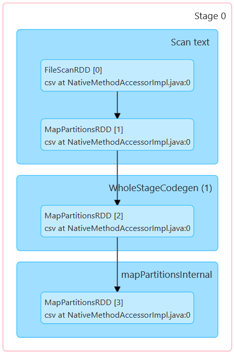

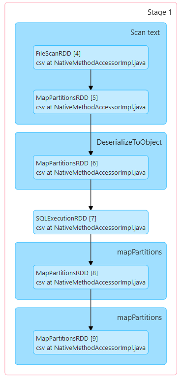


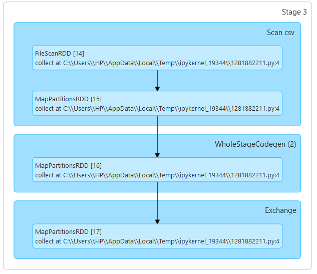

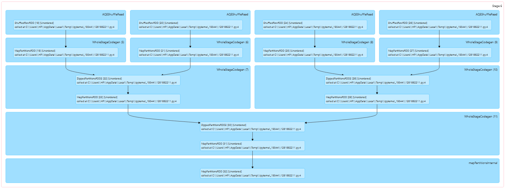

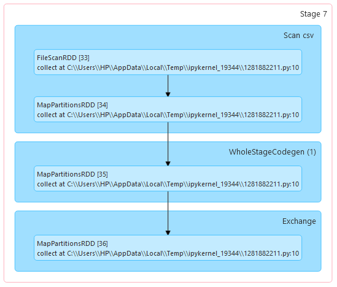

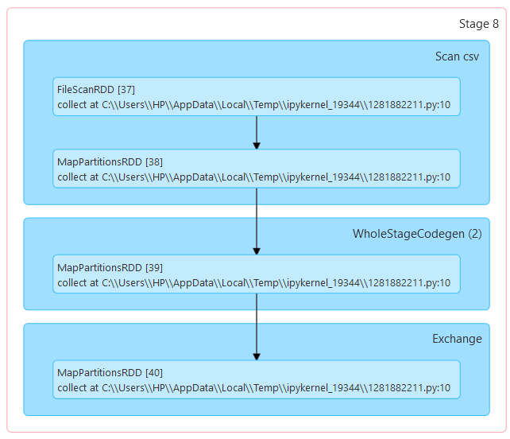

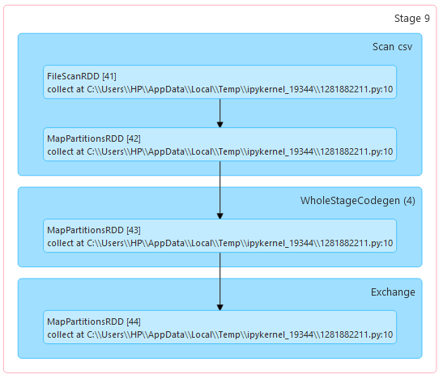

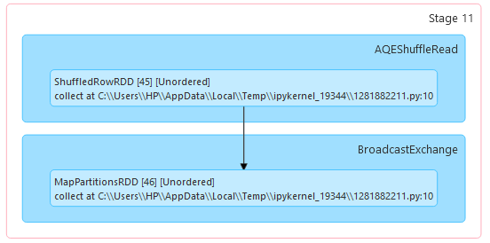

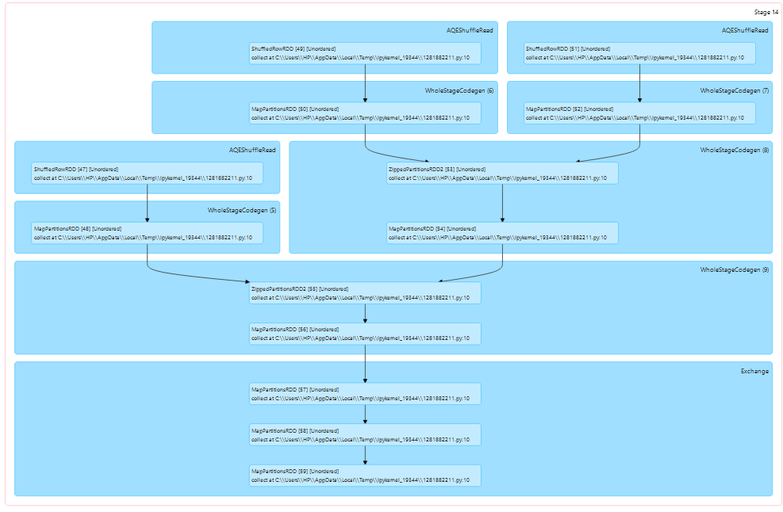

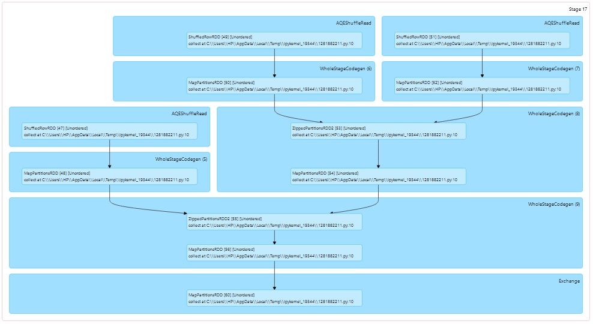


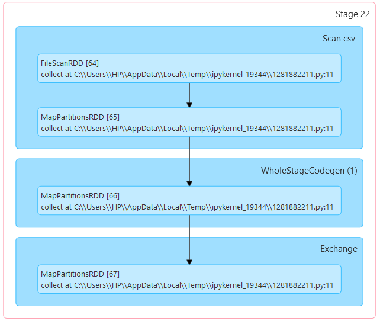

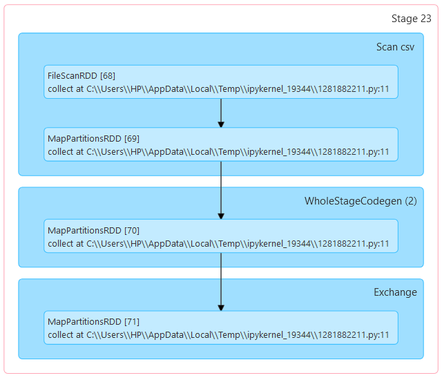

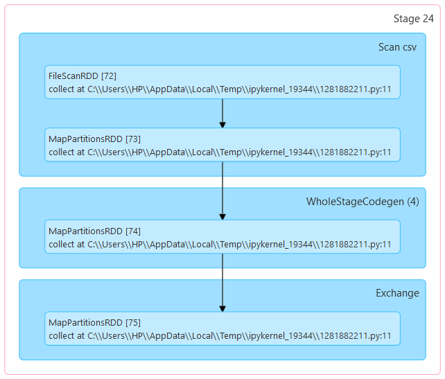

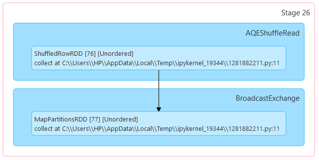

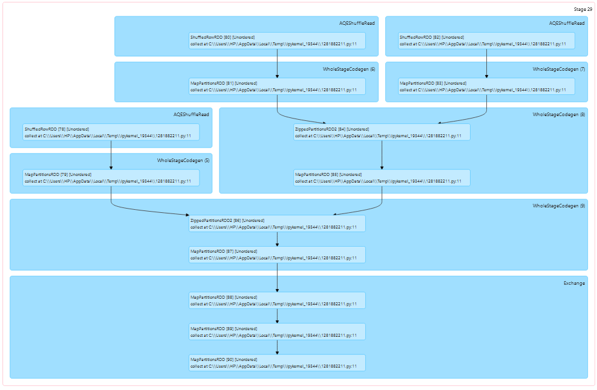


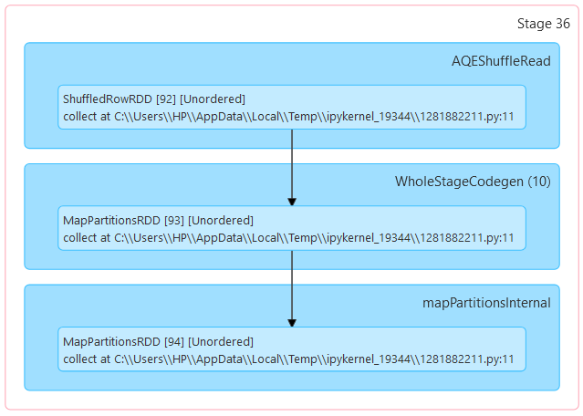

### plots

(you can click the section name to visit the html file)

1. [文心四路](./results/task5/figure_of_文心四路.html)
   the in use berthage almost reach 100% before Jan 12 and only reach 40% after then
   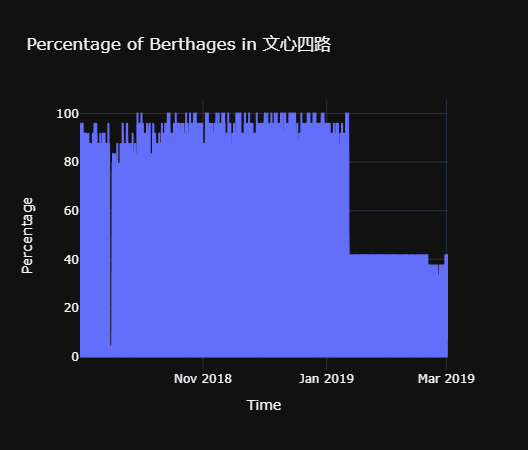
2. [科技南一路](./results/task5/figure_of_科技南一路.html)
   Sep 16 reach 0% and never reach 40%
   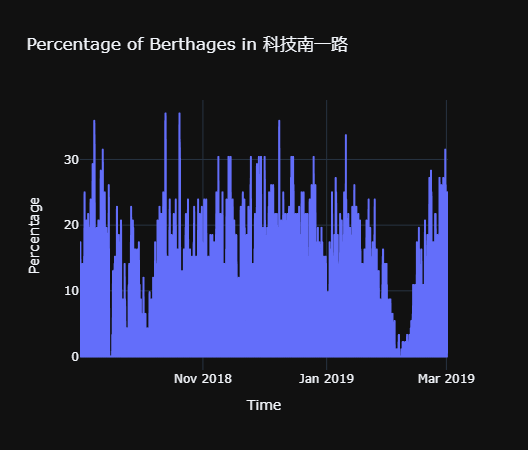
3. [创业路(南油段)](./results/task5/figure_of_创业路(南油段).html)
   increase and decrease repeatedly while highest almost reach 90%
   .png)

## PROBLEMS

1. file storage problem

in the beginning, I used the `pyspark` to store the data `result.write.csv(output_path, header=True)`
but it is useless in Windows system and need Hadoop system to run
in order to solve this problem, I used `pandas` to store the dataframe `result_pd.to_csv(output_path, index=False, header=True)`
