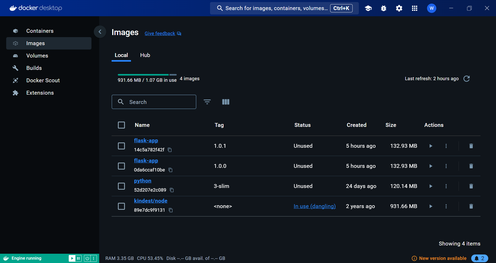
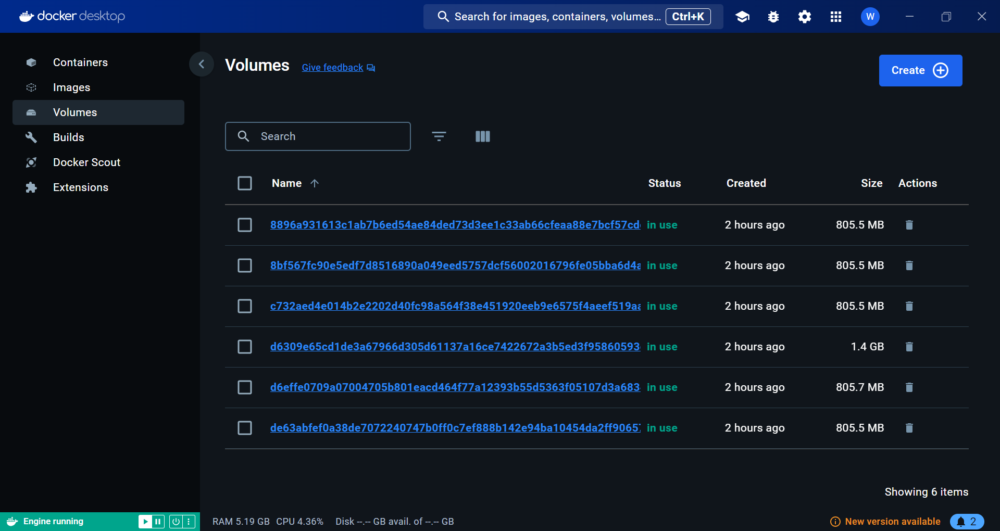
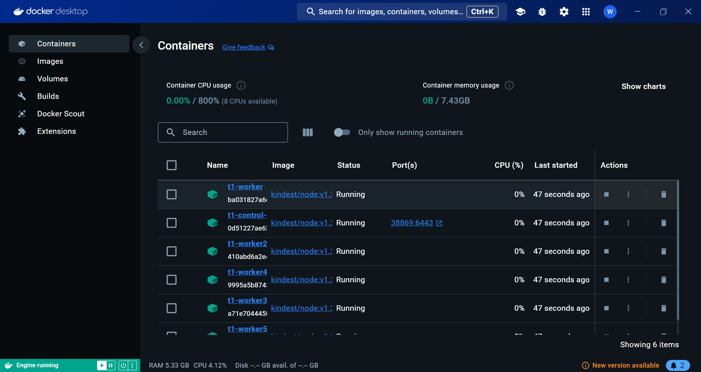
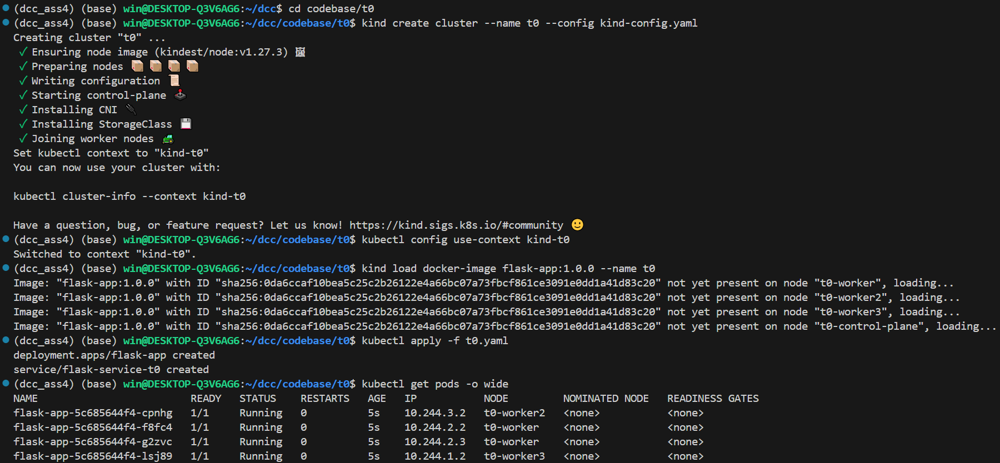
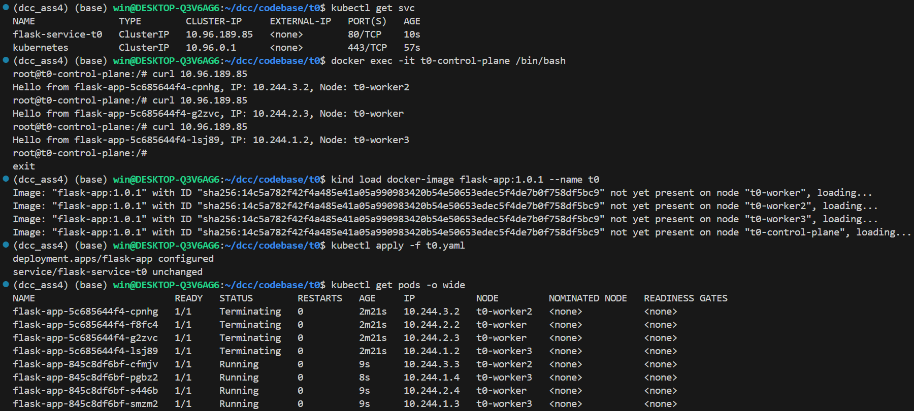
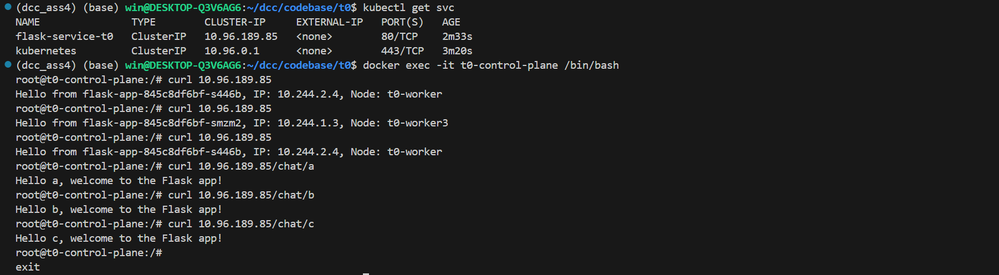
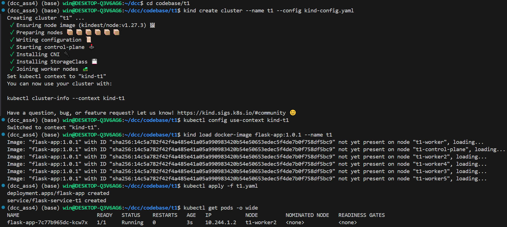
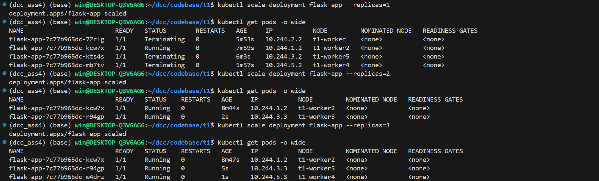
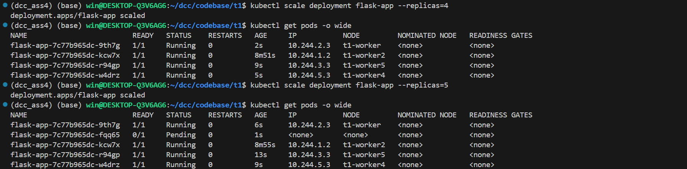

# DISTRIBUTED SYSTEMS ASSIGNMENT REPORT

<div align="center">


**ASSIGNMENT REPORT**

**Assignment ID: Assignment4 - Exploring Kubernetes**
</div>

**Student Name: 王谦益**

**Student ID: 12111003**

## DESIGN

### Task 0: K8s Deployment & Service

1. **modify the root API**
   1. create `app.py` and form root API, which returns pod name, pod IP, node name

      ```python
      @app.route('/')
      def hello():
         pod_name = os.getenv('POD_NAME', 'unknown')
         pod_ip = os.getenv('POD_IP', 'unknown')
         node_name = os.getenv('NODE_NAME', 'unknown')
         return f"Hello from {pod_name}, IP: {pod_ip}, Node: {node_name}\n"
      ```

   2. initial `Dockerfile` and `requirements.txt`

      ```Dockerfile
      FROM python:3-slim
      WORKDIR /app
      COPY requirements.txt app.py ./
      RUN pip3 install --no-cache-dir -r requirements.txt
      CMD [ "python", "app.py" ]
      ```

   3. write `kind-config.yaml` file to create a 4-node k8s cluster (1 control plane + 3 worker nodes)

      ```yaml
      kind: Cluster
      apiVersion: kind.x-k8s.io/v1alpha4
      name: flask-cluster
      nodes:
      - role: control-plane
      - role: worker
      - role: worker
      - role: worker
      ```

   4. use `t0.yaml` to create a deployment and service
   5. run `docker build -t flask-app:1.0.0 .` to get the image
   6. run `kind create cluster --name t0 --config kind-config.yaml` to create the cluster
   7. run `kind load docker-image flask-app:1.0.0 --name t0` to load the image into the cluster
   8. run `kubectl apply -f t0.yaml` to create the deployment and service
   9. run `kubectl get svc` to get `ip` address and run `docker exec -it t0-control-plane /bin/bash` to start the container
   10. run `curl <ip>` to get the result
2. **graceful shutdown**

      ```python
      def graceful_shutdown(signum, frame):
         print("Gracefully shutting down...")
         sys.exit(0)

      signal.signal(signal.SIGTERM, graceful_shutdown)
      ```

3. **greet-with-info API**
   1. add API in `app.py`

      ```python
      @app.route('/chat/<username>')
      def greet_with_info(username):
         return f"Hello {username}, welcome to the Flask app!\n"
      ```

   2. fix `t0.yaml` by changing the `image: flask-app:1.0.0` to `image: flask-app:1.0.1`
   3. run `docker build -t flask-app:1.0.1 .` to get the new image
   4. run `kind load docker-image flask-app:1.0.1 --name t0` to update the image into the cluster
   5. run `kubectl apply -f t0.yaml` to change the deployment and service
   6. run `kubectl get svc` to get `ip` address and run `docker exec -it t0-control-plane /bin/bash` to start the container
   7. run `curl <ip>` and `curl <ip>/chat/<username>` to get the result

### Task 1: K8s Pod Scheduling

1. delete the deployment and service of t0
2. write `kind-config.yaml` file to createa a 6-node k8s cluster (1 control plane + 5 worker nodes)

   ```yaml
   kind: Cluster
   apiVersion: kind.x-k8s.io/v1alpha4
   nodes:
   - role: control-plane
   - role: worker
      labels:
         usage: normal      
   - role: worker
      labels:
         usage: normal
         capability: powerful
   - role: worker
      kubeadmConfigPatches:
      - |
         kind: JoinConfiguration
         nodeRegistration:
         kubeletExtraArgs:
            node-labels: "usage=normal,capability=powerful"
         taints:
         - key: class
            value: "vip"
            effect: NoSchedule
   - role: worker
      labels:
         usage: backup
   - role: worker
      labels:
         usage: backup
   ```

3. use `t1.yaml` to create a deployment and service
4. run `kind create cluster --name t1 --config kind-config.yaml` to create the cluster
5. run `kind load docker-image flask-app:1.0.1 --name t1` to load the image into the cluster
6. run `kubectl apply -f t1.yaml` to create the deployment and service
7. run `kubectl scale deployment flask-app --replicas=<i>` from 1 to 5 and run `kubectl get pods -o wide` each time to get the result
8. improve `t1.yaml` by adding code

   ```yaml
   tolerations:
   - key: "class"
      operator: "Equal"
      value: "vip"
      effect: "NoSchedule"
   ```

9. run `kubectl apply -f t1.yaml` to update the deployment and service and run `kubectl get pods -o wide` to get the result

## RUNNING RESULT

### docker

1. docker images
   - flask-app:1.0.0: only root API
   - flask-app:1.0.1: both root and greet-with-info API
   
2. docker volumes
   
3. docker containers(only t1 is running because t0 is already deleted)
   

### t0

1. get into t0 floder, create cluster t0, load image 1.0.0, apply t0.yaml
   
2. use `kubectl get svc` to get the ip address, start container, and curl the ip address, load new image 1.0.1, apply t0.yaml to update
   
3. search ip, start container and curl the ip address again
   

### t1

1. get into t1 floder, create cluster t1, load image 1.0.1, apply t0.yaml
   
2. scale deployment from 1 to 3 and get pods each time
   
3. scale deployment from 3 to 5 and get pods each time, find a pod is not ready
   
4. improve t1.yaml and apply t1.yaml to update
   

## PROBLEMS

when write `kind-config.yaml` for t1 in the first time, I use:

```yaml
- role: worker
   labels:
      usage: normal
      capability: powerful
   taints:
      - key: class
         value: "vip"
         effect: NoSchedule
```

but there's error:

```text
ERROR: failed to create cluster: unable to decode config: yaml: unmarshal errors
```

then I check the slides and change the code to:

```yaml
- role: worker
    kubeadmConfigPatches:
    - |
      kind: JoinConfiguration
      nodeRegistration:
        kubeletExtraArgs:
          node-labels: "usage=normal,capability=powerful"
        taints:
        - key: class
          value: "vip"
          effect: NoSchedule
```

then it works

## Advice on Future Cloud Computing Lab

As for me, I think the lab is good, but I think it can be improved by adding more details and examples about cloud platform or cloud security measures and data storage solutions maybe.
