# DISTRIBUTED AND CLOUD COMPUTING

- labs' notes

## LAB1: MPI INTRODUCTION AND SETUP

## 1 MPI: Message Passing Interface

a message passing standard to allow for distributed / parallel computation

### 1.1 Processes

managed by MPI and run concurrently (at the same time)

### 1.2 Communicators

group processes and assign them ranks

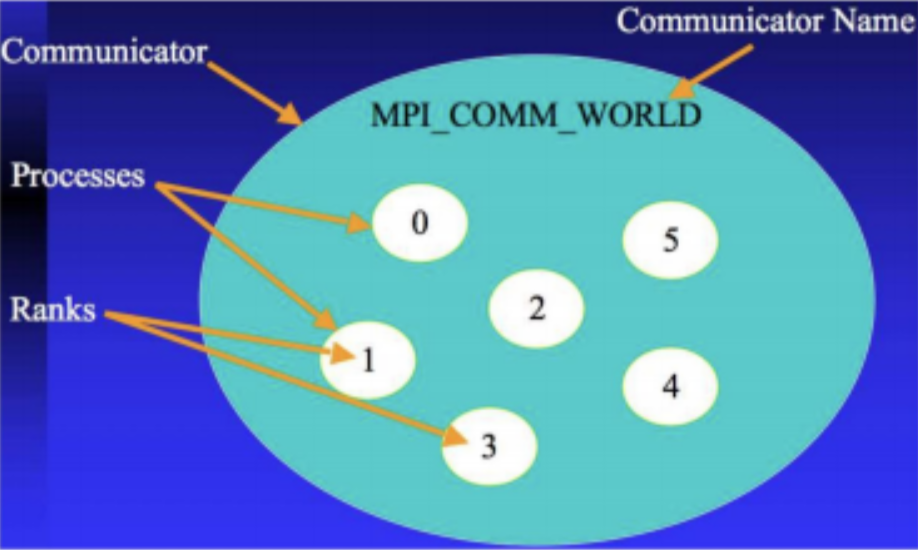

### 1.3 Code

- **How to start a MPI**

```bash
mpicc [file_name].c -o [executable_name]
mpirun -np [x] ./[executable_name] (-np X: tells MPI how many processes to create)
```

- **Boilerplate code**

``` C++
#include <mpi.h>
int main(int argc, char* argv[]) 
{
  // Initialization
  MPI_Init(NULL, NULL);
  // APPLICATION LOGIC.
  
  // Finalize MPI.
  MPI_Finalize();
}
```

- Useful functions

```C++
// Get the number of processes
int world_size;
MPI_Comm_size(MPI_COMM_WORLD, &world_size);

// Get the rank of the process
int world_rank;
MPI_Comm_rank(MPI_COMM_WORLD, &world_rank);
```

- Message Passing Interface (MPI)

```C++
#include <mpi.h>
#include <stdio.h>
int main(int argc, char* argv[]) {
  // Initialization
  MPI_Init(NULL, NULL);
  // Get the number of processes
  int world_size;
  MPI_Comm_size(MPI_COMM_WORLD, &world_size);
  // Get the rank of the process
  int world_rank;
  MPI_Comm_rank(MPI_COMM_WORLD, &world_rank);
  // Get the name of the processor
  char processor_name[MPI_MAX_PROCESSOR_NAME];
  int name_len;
  MPI_Get_processor_name(processor_name, &name_len);
  // Print off a hello world message
  printf("Hello world from processor %s, rank %d out of %d processors\n", processor_name, world_rank, world_size);
  // Finalize the MPI environment.
  MPI_Finalize();
}
```

## LAB 2: MPI COMMUNICATION MODELS

## 2 MPI Communication Modes

### 2.1 Basic Informations

- Differences: The method of sending message and the state of receiver
- Locality of mode: whether the mode requires communicating with other processes
  - Local: Completion of procedure depends only on local process
  - Non-local: Completion of procedure needs to execute some MPI procedure on another process

### 2.2 Communication modes

- Standard mode
  - MPI determines if the data will be **buffered**
  - Buffered: Copy the data into a buffer and return immediately
    - The sending will be done by MPI in background
  - Non-buffered: Return when the data has completed sending
  - non-local
    - Non-buffered case required processes to communicate
- Buffered mode
  - **always** copies the data to a provided buffer and returns immediately
  - local
- Synchronous mode
  - only returns when the recipient has started receiving message
  - Sending and receiving tasks must ‘handshake’
  - Handshake procedure ensures both processes are ready
  - non-local
- Ready mode
  - assumes the recipient is at ready state
  - recipient unable to receive $\rightarrow$ Error
  - non-local

- **table**
  
  | MPI communication mode | Locality of mode |
  | :--: | :--: |
  | Standard Mode | non-local |
  | Buffered Mode | local |
  | Synchronous Mode | non-local |
  | Ready Mode | non-local |

### 2.3 BLOCKING & NON-BLOCKING COMMUNICATION

- Blocking communication:
  - The function waits until operation is completed to return
  - Suspends execution until the message buffer being sent / received is safe to use
    - Example: MPI_Send, MPI_Recv
- Non-blocking communication:
  - Function call returns immediately
  - The actual operation is completed by MPI in background
  - User must ensure operation is completed before using received data
    - Example: MPI_Isend, MPI_Irecv

### 2.4 Available send & receive functions

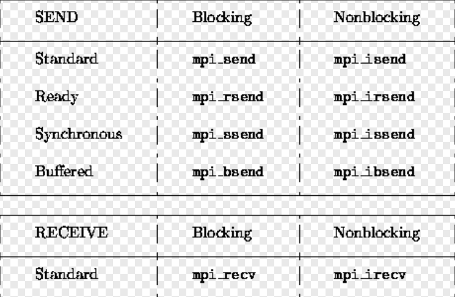

### 2.5 MPI Datatypes

**Complex MPI applications typically use MPI_BYTE to communicate with custom protocols**

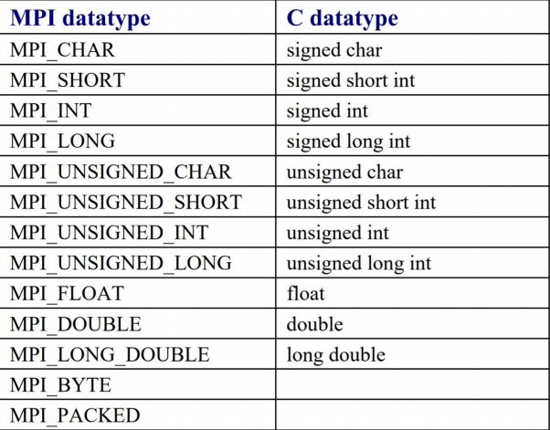

## 3 MPI Collective Communication

### 3.1 Collective Communication

- one to many (1-N) | many to one (N-1) | many to many (N-N)
  - In 1-N and N-1 modes: the “1” process is often called ‘root’
- Collective communication is the ‘bread and butter’ communication of distributed systems!

#### 3.1.1 Synchronization

```C++
int MPI_Barrier(MPI_Comm comm)
```

Blocks execution of process in the given communicator until all processes (in that that communicator) have reached their barrier

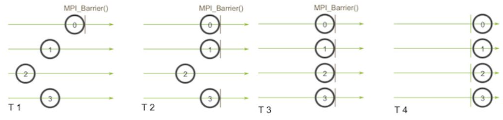

#### 3.1.2 Broadcast message to all processes (1-N)

```C++
int MPI_Bcast(void* buf, int count, MPI_Datatype datatype, int root, MPI_Comm comm)
```

Root sends message to all processes in the communicator

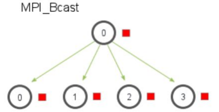

#### 3.1.3 Split data amongst all processes (1-N)

```C++
int MPI_Scatter(void * sendbuf, int sendcount, MPI_Datatype sendtype, void * recvbuf, int recvcount, MPI_Datatype recvtype, int root, MPI_Comm comm)
```

All processes send a message to root

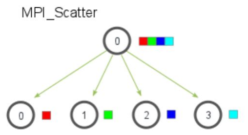

#### 3.1.4 Receive messages from all processes (N-1)

```C++
int MPI_Gather(void * sendbuf, int sendcount, MPI_Datatype sendtype, void * recvbuf, int recvcount, MPI_Datatype recvtype, int root, MPI_Comm comm)
```

Root receives a message from all processes in the communicator (including root!)

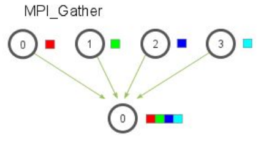

#### 3.1.5 Reduce (N-N)

**Reduce methods implement a distributed computation using data distributed over all processes**
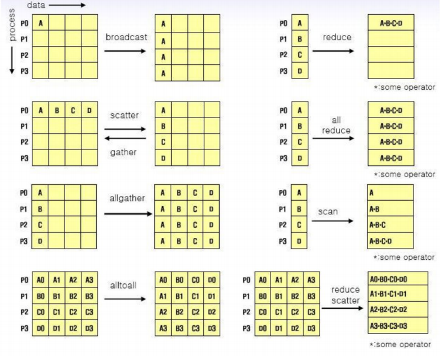

- MPI_Reduce: result of computation is gathered by the ROOT
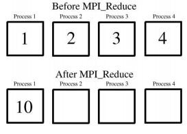
- MPI_Allreduce: result of computation is broadcasted to all processes
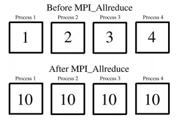
- Scan: Each process get the first “rank” items
  - process 1 gets the first item
  - process 2 gets the first two items
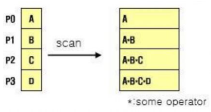
- AlltoAll: Each process gets all “rank” items
  - process 1 gets all the items with index 1
  - process 2 gets all items with index 2

- MPI_Reduce_scatter: scatters data and perform reduction
  - The ‘scatter’ operation is an AllToAll operation
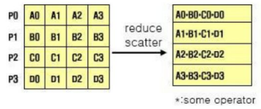

### 3.2 Parallelize Computation – Merge Sort

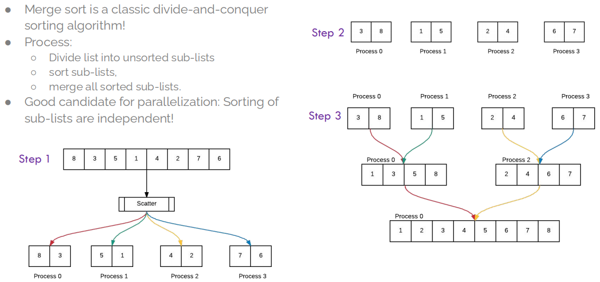

## LAB 3: MPI REDUCE AND DOCKER

## 4 Towards Containerized Applications

### 4.1 Virtualization: Enabling Cloud Computing

- Virtualization
  - creates virtual representations of hardware
  - powers cloud computing services by helping organizations manage infrastructure
- Virtual Machine Monitor (VMM, or Hypervisor)
  - a type of computer software, wor hardware that creates and runs virtual machines (VMs).
  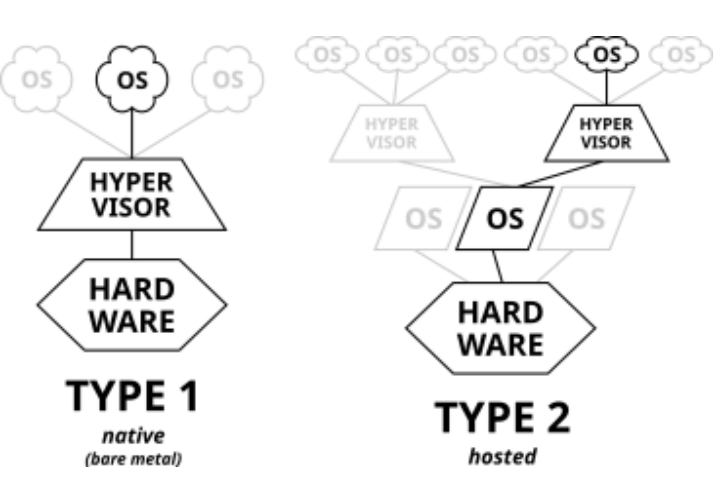

### 4.2 Containerization

- Containers
  - lightweight packages of application code together with dependencies required to run your software services
- Containers compared to VMs
  - Efficient:
    - containerized apps share the hosting OS kernel, thus using fewer resources.
    - even easier environment setup.
  - Lightweight: do not carry OS; only contain necessary libraries & tools.
  - Portability: OS-independent, thus movable to PCs/VMs/Cloud
  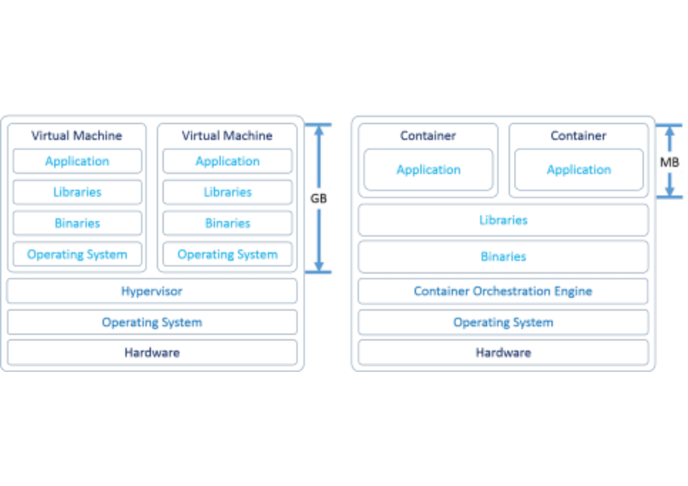
  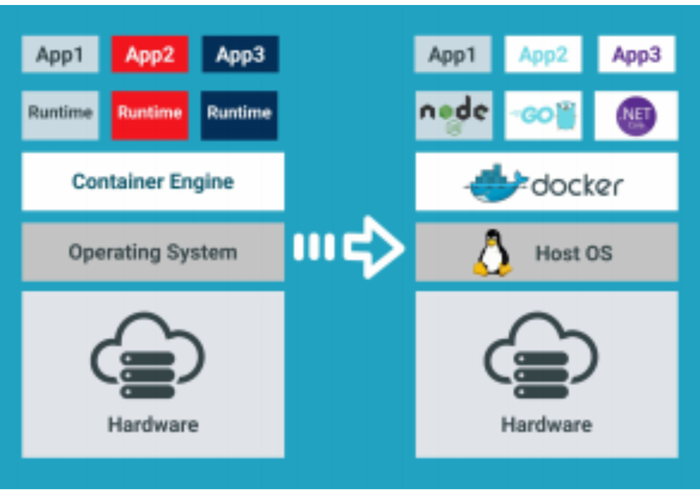

### 4.3 Docker

#### 4.3.1 Basic Concepts

- Registry
  - Docker Hub
- Image
  - OS like ubuntu
  - apps like postgres
- Container
  - image instance
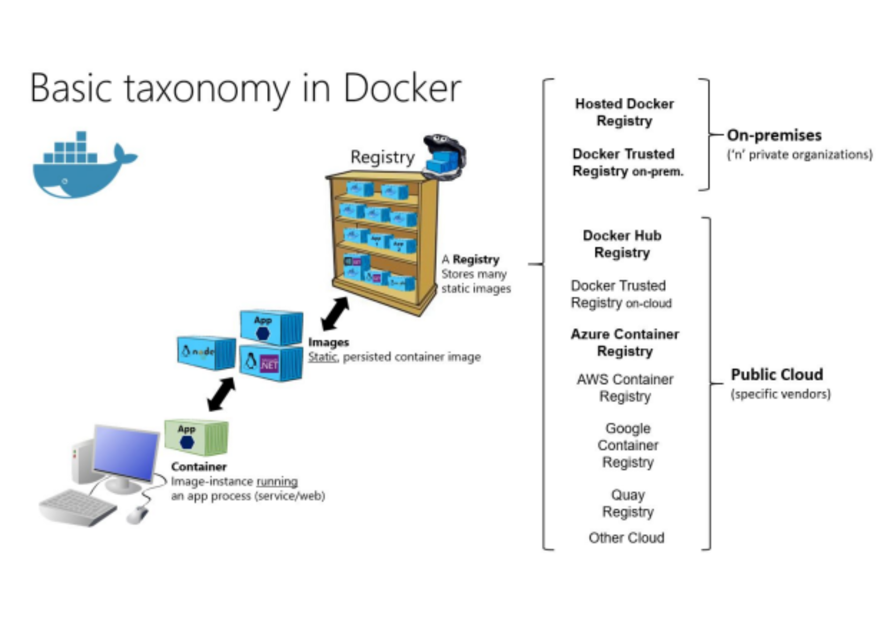

#### 4.3.2 Architecture

- Registry
  - pull images
  - docker pull
- Image
  - build images
  - requires Dockerfile
  - docker build
- Container
  - run images
  - docker run
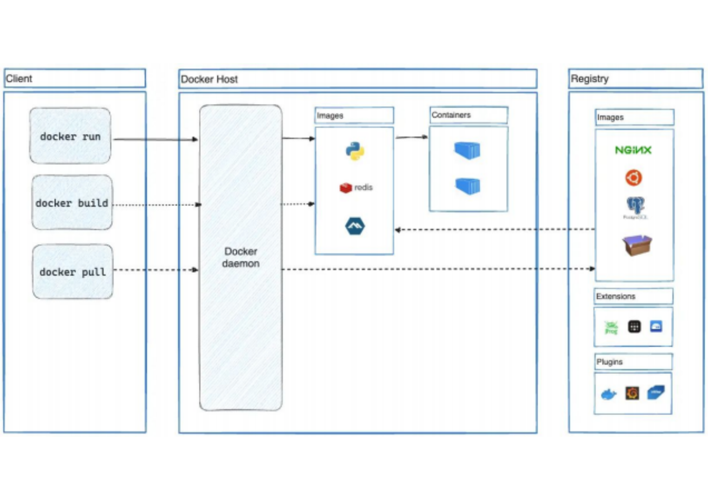
- Docker CLI/Client
  - docker commands
- Docker daemon
  - middleman between Docker Client & docker objects
- Docker Desktop
  - includes the above

#### 4.3.3 Setup

- Verify installation by: `docker run -d -p 8080:80 docker/welcome-to-docker`
- Find the corresponding container ID/name: `docker ps`
- Stop the container: `docker container stop [ID/NAME]`
- Remove the container: `docker container rm [ID/NAME]`

### 4.4 Docker Compose, Swarm & Kubernetes

- Docker Compose
  - a tool for defining and running multi-container applications on a single host.
  - Requires compose.yaml
- Docker - Swarm mode
  - an advanced feature for managing a cluster of Docker daemons - running multi-container applications on multiple hosts.
- Kubernetes (K8s)
  - a portable, extensible, open source platform for managing containerized workloads and services, that facilitates both declarative configuration and automation (more details in the future)

### 4.5 Test MPI with Docker Compose

- **code used in temple**
  1. Build an image named mpi1: `docker build -t mpi1 .`
  2. Start 2 containers: `docker compose up -d`
  3. Access the first container: `docker exec -it [container_name] /bin/bash`
  4. Switch to the 'mpi' user: `su mpi`
  5. Write host file for mpirun:
     1. `echo node1 slots=n > host`
     2. `echo node2 slots=n >> host`
     3. `...`
     4. `echo nodex slots=n >> host`
     5. p.s.
        1. x depends on the number of nodes written in the compose.yaml file
        2. set n whatever you want
  6. Grant execution permission to the MPI Hello World program (password=mpi): `sudo chmod 777 ./mpi_files/[file_name]`
  7. Execute the MPI Hello World program: `mpirun -n [total_number_of_slots] --hostfile host ./mpi_files/[file_name]`
  8. As a final step, clean up the resources by: `docker compose down`
- [**Dockerfile**](./files/lab3/Dockerfile)
  - FROM: define a base image.
  - ENV: set environment variables.
  - RUN: execute build commands.
  - EXPOSE: describe which ports you application is listening on.
  - WORKDIR: change working directory.
- [**compose.yaml**](./files/lab3/compose.yaml)
  - container_name: used for accessing container by name.
  - hostname: used for mpirun to recognize hosts by host file.
  - image: specify the mpi1 image we built.
  - networks: configure a basic bridge network between 2 hosts.
  - command: override the default command by the container image.
  - Volumes: define mount host paths or named volumes that are accessible by service containers.

## LAB 4: SERVICES & API ARCHITECTURES

## 5 Web Services & RESTful API

### 5.1 Local Program ➡ Web Service

- Local Program ➡ Modular Service
  - Task Orientation + Reusability: group functions / procedures as a **service**.
  - Independent Development: Separate client and service code - **Modularization**.
- Local Service ➡ Web Service
  - **Web Service**: "a service offered by an electronic device to another electronic device, communicating with each other via <u>the Internet</u>".
  - Making services web-ready: utilize web standards.
    - Network Protocols (e.g., HTTP, HTTPS)
    - Data Formats (e.g., XML, JSON)

### 5.2 Application Programming Interface (API)

- "APIs are mechanisms that enable two software components to communicate with each other <u>using a set of definitions and protocols</u>."
  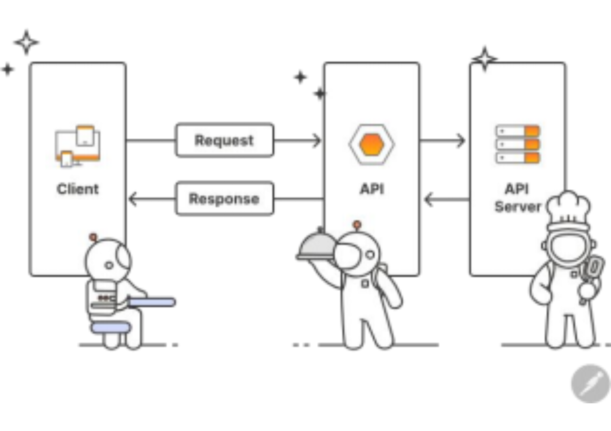

- API Architecture Patterns: different ways to design and build APIs for different purposes and scenarios
  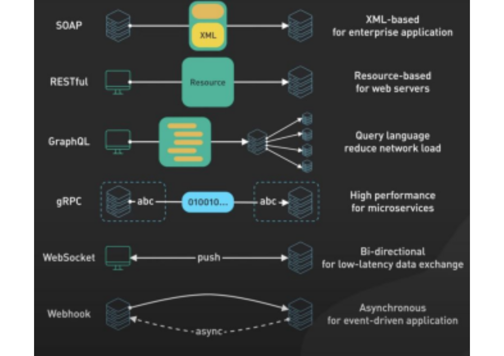
  - SOAP (严格、复杂、详细)
    - uses XML messages + a predefined contract
    - strict, complex, and verbose
  - RESTful API (简单、快速、灵活)
    - manages resources via common web standards
    - uses HTTP methods to operate on JSON/XML
    - simple, fast, and flexible
  - GraphQL (适合于复杂的数据需求)
    - queries exactly needed within a single requests
    - suitable for complex data requirements
  - RPC (抽象了网络通信的复杂性)
    - accesses remote services as if they were local
    - abstracts the complexity of network communication
  - WebSocket (享受实时反馈)
    - enables fast, bidirectional, and persistent connections
    - benefits live chat apps and real-time gaming
  - Webhook (支持异步和事件驱动的通知)
    - supports asynchronous & event-driven notifications
  .png)

### 5.3 RESTful API Components

- **Resource**: identified by an endpoint/URL
- **HTTP method**: specifies an operation on the resource (e.g., GET, POST, etc.)
- **HTTP request**:
  - Header: metadata —— Content-Type = application/json
  - Query Parameters —— /users?age=25&sort=desc
  - Request Body
- **HTTP response**:
  - Status code + message
    - 200 OK
    - 404 Not Found
    - …
  - Header
  - Response Body

## 6 Microservices & gRPC

### 6.1 Monolithic Service ➡ Microservices

- Microservices (微服务：松散耦合、细粒度服务的集合，使用轻量级协议)
  - Definition: "an architectural pattern that arranges an application as <u>a collection of loosely coupled, fine-grained services</u>, communicating through <u>lightweight protocols</u>"
  - Features:
    - Finer granularity: each microservice is small and modular (小且模块化、相互独立)
    - Improved Flexibility & Scalability: easier migration & load balancing (更加灵活、可变)
    - Loosely coupled: (松耦合、相互影响很小)
      - Design phase: refactoring a microservice does not heavily the others
      - Deployment phase: self-contained microservices can be deployed concurrently
      - Runtime phase: an unavailable microservice does not severely affect the others
    - Cross-platform & Cross-Language: each microservice can be written with different programming languages and deployed to different OS platforms (可跨平台、跨语言)
    - Cloud Ready: easier packaging into containers, more efficient resource utilization (更容易打包成容器)
  - **gRPC** is currently a popular architecture for microservices

### 6.2 Microservices with gRPC

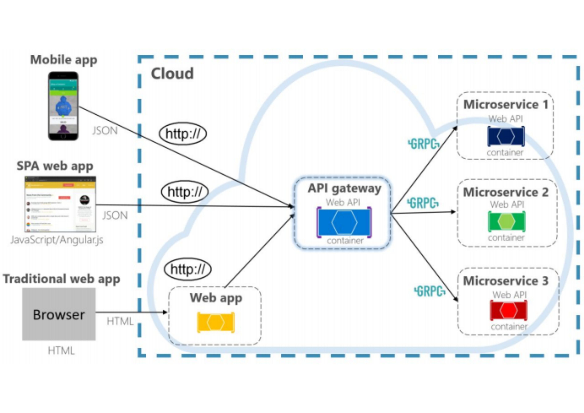

## LAB 5: RPC - GRPC & JAVA RMI

## 7 Introduction to RPC Protocol

### 7.1 Remote Procedure Call (RPC)

远程程序调用 (RPC): 在不同地址空间的进程，不需要额外编程就能执行类似本地调用的效果

- serve remotely
- invoke as if it were local
- abstract remote interaction details

### 7.2 RPC

#### 7.2.1 Design Concerns

- Protocol:
  - Also referred to as Contract, Interface, or Interface Definition Language (IDL)
  - Procedure signature:
    - Name
    - Input parameters
    - Output format
  - Specifying the protocol in advance:
    - allows clients and servers to perform implementations independently;
    - supports advanced client/server-side code generation for RPC.
- Communication:
  - Also referred to as Transmission
  - Serialization: pack request parameters into a transmittable format
  - Network Protocol: use TCP or HTTP to manage the internet connection
  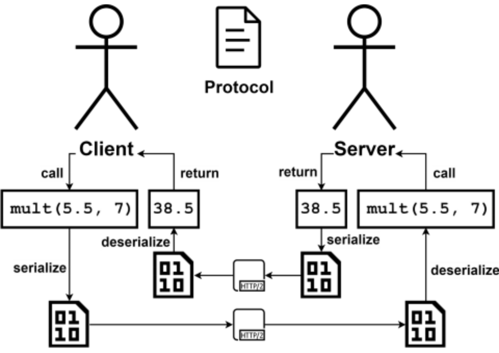
  - To reduce the network communication overhead:
    - shrink the transmission data size
    - select an appropriate network protocol to manage multiple requests (potentially for multiple RPC procedures) efficiently
- Proxy(代理服务器):
  - Client Stub:
    - just focus on requesting the correct procedure with the correct parameters, <u>while letting someone help me handle the rest</u>
    - Also referred to as Client-side Proxy
  - Server Stub:
    - just focus on the procedure implementation, <u>while letting someone help handle the rest</u>
    - Also referred to as Server-side Proxy, Skeleton
  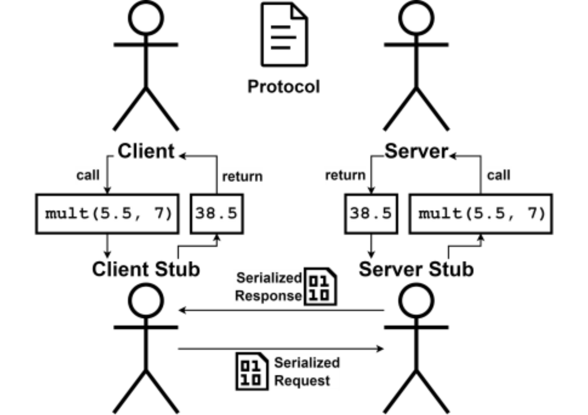

#### 7.2.2 Common Structure

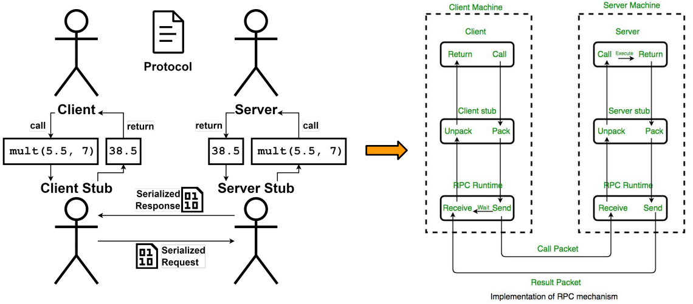

#### 7.2.3 Application Scenarios

- Network File System (NFS):
  - Makes remote file operations (e.g., file copying) feel local.
  - `cp /mnt/nfs/data.txt ~/Documents/new_data.txt` as usual, RPC will handle the communication details behind the scene.
  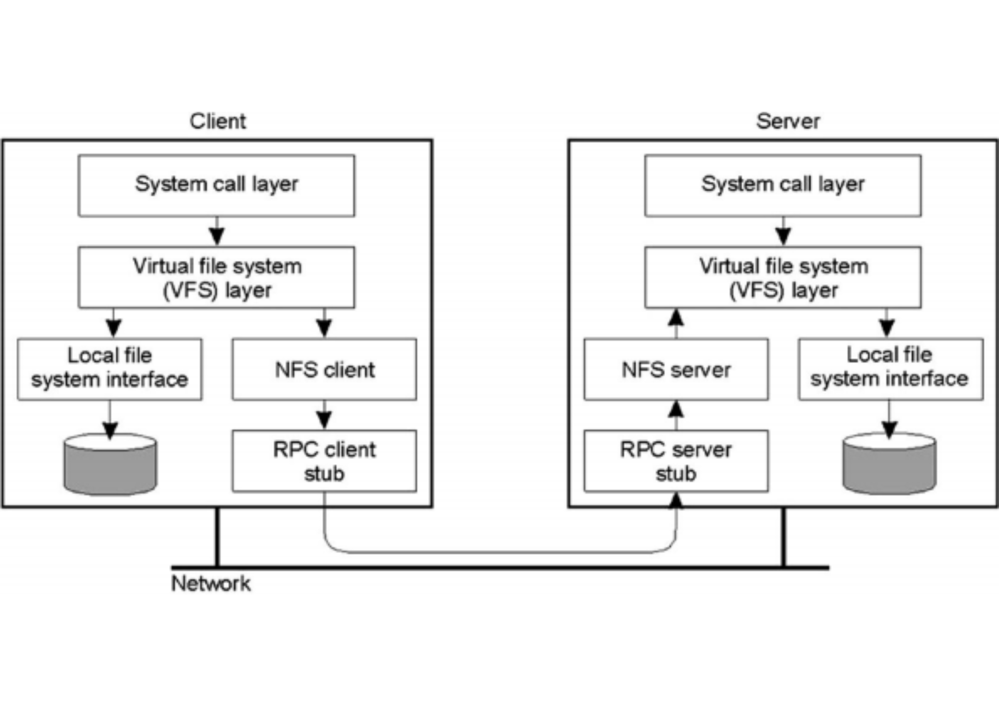
- PyTorch Distributed RPC:
  - Manages multi-machine model training/inference.
  - Supports referencing remote objects without copying the real data around
- Backend-to-backend Communication in Microservices
- ...
  
## 8 Implementing RPC

### 8.1 gRPC

#### 8.1.1 Hello World (TASK)

Implement a Hello World gRPC Python example.
> Reference codebase: [`rpc_grpc_hello_world`](files/lab5/rpc_grpc_hello_world/README.md)

1. Set up Python (Miniconda is recommended)
2. Install Python dependencies into a Conda environment via:
   - `python -m pip install -r requirements.txt`
3. Check the protocol file `assistant.proto`. Use protoc to generate some code:
   - `python -m grpc_tools.protoc -I./ --python_out=. --pyi_out=. --grpc_python_out=. assistant.proto`
   - These generated code will be utilized to implement the gRPC client and the gRPC server
4. Implement the gRPC server in `hw_server.py.` Run the gRPC server via:
   - `python hw_server.py`
5. Implement the gRPC client in `hw_client.py`. In another terminal, run the gRPC client via:
   - `python hw_client.py`

#### 8.1.2 Protocol Definition

- gRPC uses proto files to define (Proto files are a part of Protocol Buffers - Protobuf):
  - messages (`repeated string snippets = 3;`)
    - field property (e.g., repeated)
    - field type (e.g., string)
    - field name
    - field tag/number: ordering of fields
  - remote procedures
    - name
    - request message
    - response message
  - services
    - organized set of remote procedures
- Proto files serve as the Interface Definition Language (IDL) for RPC
  - "a language that lets a program written in one language communicate with another program written in an unknown language."
  - Example: a gRPC server is implemented in C++. It can interact with a Ruby gRPC client, or a Java gRPC client from Android platform.
  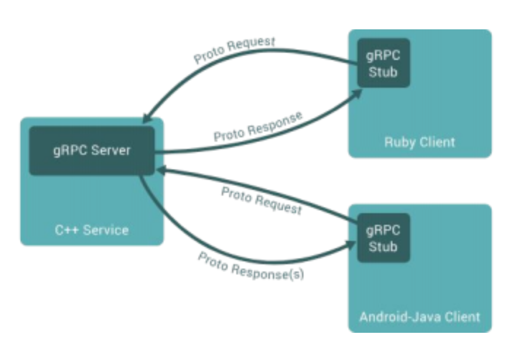
- Proto files can be compiled by protoc to generate code from different programming languages:
  - message classes
  - gRPC client stub
  - gRPC server template

#### 8.1.3 Communication Handling

- Serialization:
  - Messages defined in the proto files are transmitted between the gRPC client and server
  - gRPC uses <b>Protocol Buffers (Protobuf)</b> to serialize proto messages into binaries
  - Protocol Buffers are language-neutral, platform-neutral extensible mechanisms for serializing structured data.
    - provides more compact data
    - enables faster transmission
- Network Protocol:
  - gRPC transmits serialized request/response messages over HTTP/2 framing.
  - A channel represents an HTTP/2 connection (a TCP connection behind the scene).
  - A channel manages multiple logical HTTP/2 streams, each dedicated to one procedure.
  - Messages are sent on the corresponding HTTP/2 streams as HTTP/2 frames.

#### 8.1.4 Proxy

- Client and server stubs are pre-generated via protoc in a static fashion
  - message classes
  - gRPC client stub
    - The client stub is retrieved from the gRPC channel.
    - The client calls the remote procedure via the client stub.
  - gRPC server template
    - The server extends the generated template and provides the procedure implementation.
    - The server registers the implemented procedure.

#### 8.1.5 Benefits

Why is gRPC so popular:

1. <u>Static & automatic generation of client stubs & server templates via protoc.</u>
2. Efficient communication via Protobuf.
3. Cross-Language + Cross-Platform support.
4. Bidirectional Streaming.
5. Multiplexing via HTTP/2.
6. …
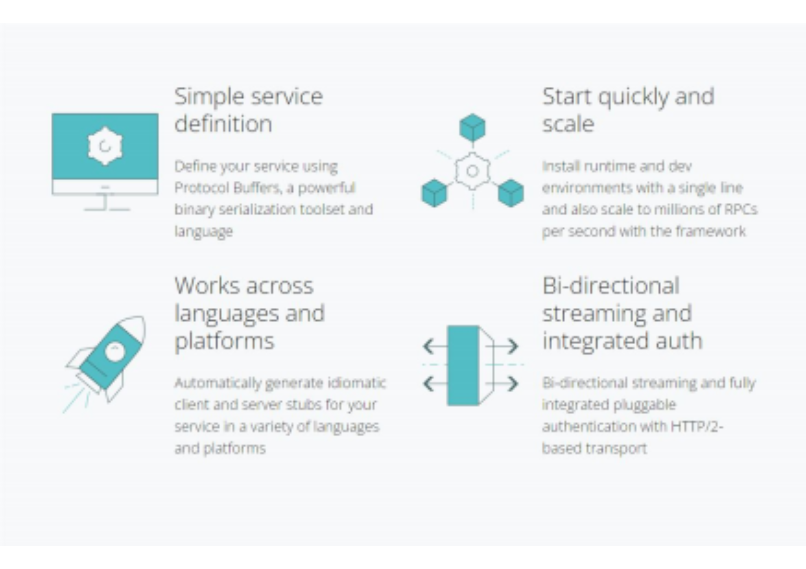

#### 8.1.6 Build gRPC Service

Refactor a local procedure into a remote procedure.
> Reference codebase: [`rpc_grpc_byogrpc`](files/lab5/rpc_grpc_byogrpc/README.md)

- Requirements:
  1. The remote procedure should be hosted by the AssistantService in the gRPC server.
  2. A gRPC client should be written to test the remote procedure.
- Reference Steps:
  1. Write the proto file.
  2. Generate code stubs via protoc.
  3. Implement and run the gRPC server.
  4. Implement and run the gRPC client.

### 8.2 Java RMI

#### 8.2.1 Java RMI As Another RPC Implementation

- "Java Remote Method Invocation (Java RMI) enables the programmer to create distributed Java technology-based to Java technology-based applications, in which the <u>methods of remote Java objects can be invoked</u> from other Java virtual machines, possibly on different hosts."
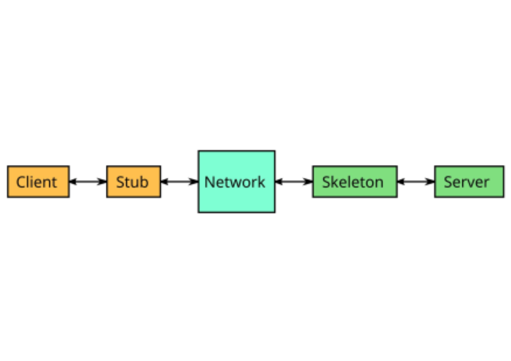
- Java RMI is a Java-specific Object-Oriented implementation of the RPC protocol.
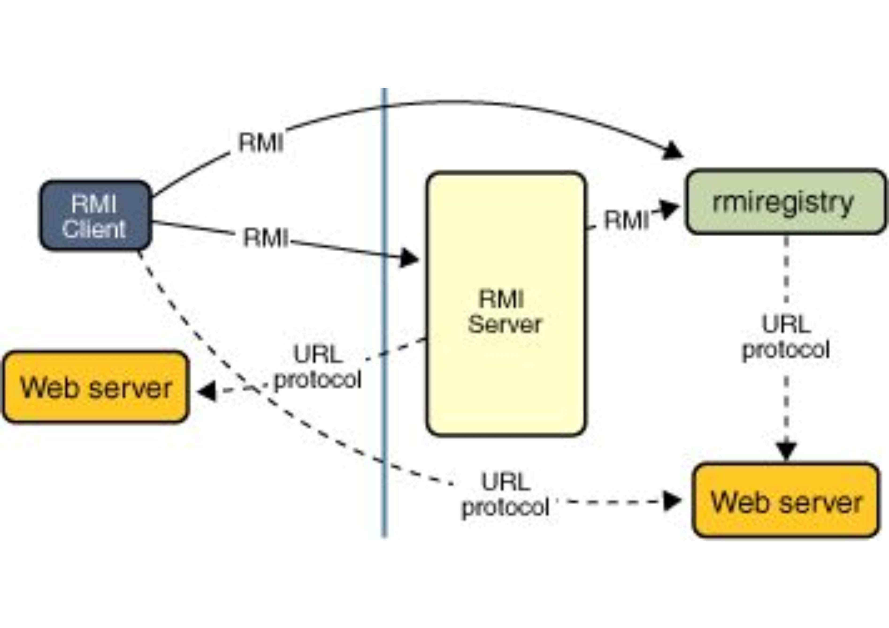

#### 8.2.2 Hello World (TASK)

Implement a Hello World Java RMI example.
> Reference codebase: [`rpc_javarmi_hello_world`](files/lab5/rpc_javarmi_hello_world/README.md)

1. Set up Java Development Kit (JDK) via:
   - `apt install default-jdk`
   - Java RMI is a built-in library, and RMI Registry is natively implemented in the rmiregistry program.
2. Check the remote interface definition file `AssistantService.java`.
   - A Java interface is defined with two remote functions.
   - The outputs are simplified to one single value, since Java cannot handle multiple output values naturally. To refine, define separate message classes.
3. Implement the RMI server: `AssistantServer.java`.
   - The interface is “implemented”.
   - A client stub is generated and registered to the RMI registry.
   - The server listens on a server socket and accept incoming remote calls after stub generation.
4. Implement the RMI client: `Client.java`.
   - The client stub is fetched from the RMI registry.
   - RMI is performed using the client stub as if the remote object were local.
5. Compile the source files via:
   - `javac -d bin/ protocol/AssistantService.java server/AssistantServer.java client/Client.java`
   - The binaries will be output to the bin/ folder.
6. Run the RMI registry at port=1099 <u>from the class path directory bin/</u>:
   - `cd bin/`
   - rmiregistry 1099
   - The RMI registry MUST be started from the generated class path folder, otherwise the server and the client will fail to locate the defined interface so that they can marshal and unmarshal remote objects as required in Java RMI.
7. Start the server in another terminal:
   - `java -cp bin/ server.AssistantServer`
8. Execute the client in another terminal:
   - `java -cp bin/ client.Client`

#### 8.2.3 Design Concerns

- Protocol:
  - uses Java interfaces to specify the remote method signatures in an OOP fashion.
- Communication:
  - Serialization: object serialization via `java.io.Serializable`.
  - Network Protocol: naive Java RMI establishes a new TCP connection for each RMI request.
- Proxy:
  - Dynamic Proxy - client stubs & server stubs (skeletons) are dynamically generated at runtime utilizing Java Reflection.
  - Since client stubs are dynamically generated by the server, an additional RMI registry is needed to forward the stubs to the client.

### 8.3 gRPC vs. Java RMI

gRPC seems to be currently far more favorable than Java RMI, mainly because:

- Cross-Language Support:
  - Java RMI is Java-specific, but gRPC supports communication across different programming languages.
- Serialization:
  - Java Object Serialization is slower and more resource-intensive (due to its general-purpose design that records lots of object metadata) than Protobuf for gRPC.
- Proxy Approach:
  - Dynamic proxy from Java RMI reduces the codebase complexity, but at the same time introduces stub generation overhead at runtime, making the execution slightly slower than gRPC.

## Lab 6: PROTOBUF + OTHER GRPC FEATURES

## 9 Serialization via Protobuf

### 9.1 Serialization

- Serialization is the process of translating a data structure or object state into a format that can be stored or transmitted and reconstructed later
- Text-based:
  1. <b>JSON</b>: key-value-based; commonly used in RESTful API
  2. XML: tag-based; commonly used in SOAP
- Binary-based:
  1. MessagePack
  2. Thrift
  3. <b>Protobuf</b>
  4. Avro

### 9.2 Protocol Buffers (Protobuf)

- Protocol Buffers are a language-neutral, platform-neutral extensible mechanism for serializing structured data
- Used by gRPC, Google Cloud Platform (GCP), Envoy Proxy, etc.
- Benefits:
  1. Compact data storage and fast parsing
  2. Cross-Language support: proto files as IDL
  3. Automatic code generation: protoc
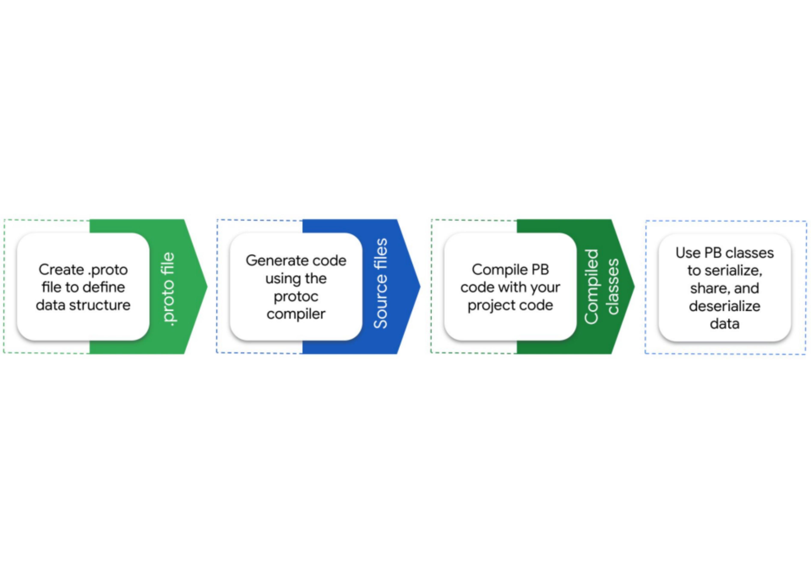

#### 9.2.1 Encoding

- JSON → Binary (MessagePack)
  1. numeric values like 1337
     - 4B → 2B
  2. {[]} + : + ,+ “”
     - 22B → 0B
  3. object/array type
     - 0B → 2B
  4. key/value type
     - 0B → 7B
  
- MessagePack → Thrift Binary
  1. ignored keys
     - 31B → 0B (keys)
     - 9B → 20B (types)
  2. uint16 → i64
     - 2B → 8B
  3. field tags
     - 0B → 6B
  4. end of struct
     - 0B → 1B
  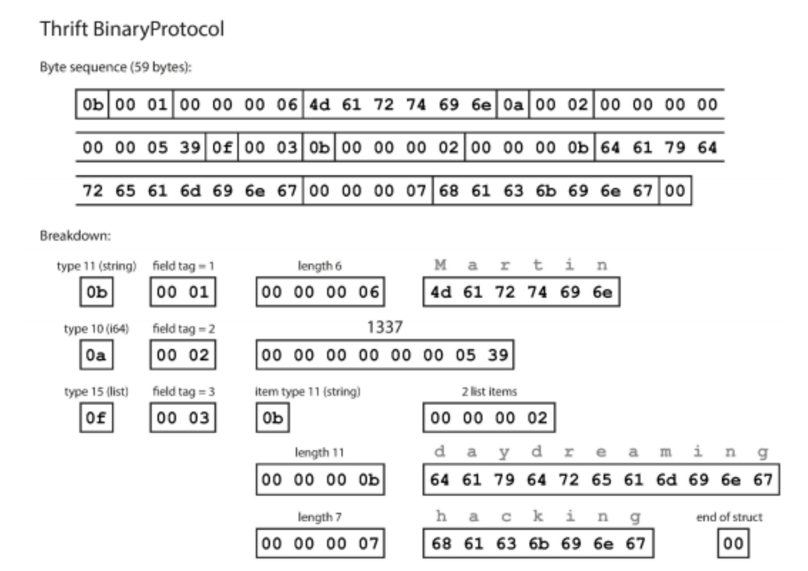
- Thrift Binary → Thrift Compact
  1. field tag + type
     - 9B → 3B (x3: 3B → 1B)
  2. i64 → varint
     - Little-endian
     - MSB - continuation bit
     - LSB (1st byte) - sign
     - 8B → 2B
  3. string/array length → varint
     - 17B → 4B
  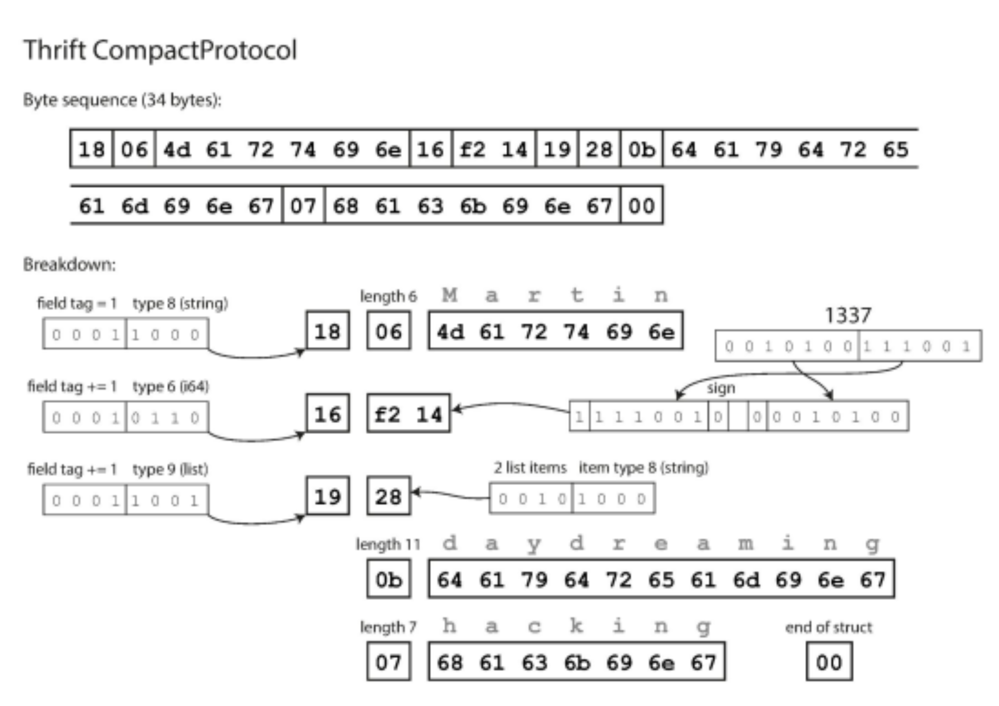
- Thrift Compact → Protobuf
  1. field tag + type
     - 3B → 4B (array item)
  2. varint
     - Sign: ZigZag encoding
  3. end of struct
     - 1B → 0B
  4. array length
     - 1B → 0B
  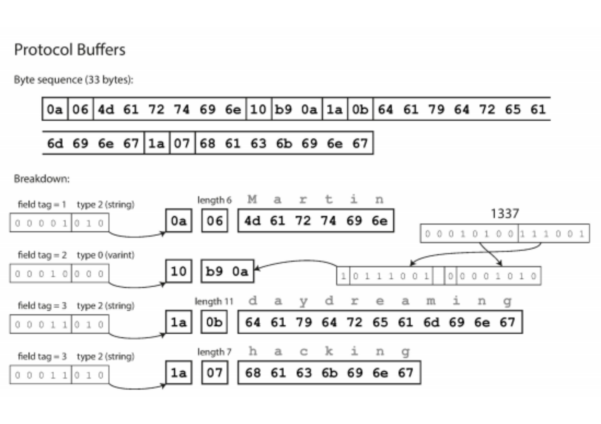
- whole process:
  - JSON:

    ```JSON
    {
      "userName": "Martin"
      "favouriteNumber": 1337
      "interests": ["daydreaming", "hacking"]
    }
    ```

  - Thrift IDL

    ```C
    struct Person {
      1: required string        userName,
      2: optional i64           favouriteNumber,
      3: optional list<string>  interests
    }
    ```

  - Protobuf IDL

      ```Protobuf
      message Person {
        required string user_name        = 1;
        optional int64  favourite_number = 2;
        repeated string interests        = 3;
      }
      ```

#### 9.2.2 Exploration(TASK)

Serialize protobuf message and compare with JSON.
> Reference codebase: [`rpc_protobuf`](files/lab6/rpc_protobuf/README.md)

1. Set up Python (Miniconda is recommended).
2. Install Python dependencies into a Conda environment via:
   - `python -m pip install -r requirements.txt`
3. Check the protocol file `assistant.proto`. Use protoc to generate some code:
   - `python -m grpc_tools.protoc -I./ --python_out=. --pyi_out=. assistant.proto`
   - Note that this time we only generate message classes.
4. Run python `x_main_reduced.py` to explore the behavior of Protobuf.

- `serialize_and_deserialize()`:
  1. Protobuf supports easy serialization and deserialization functions to implement our own gRPC, if necessary.
     1. `SerializeToString()`
     2. `ParseFromString(binary_req)`
  2. Protobuf uses a specific binary encoding scheme - explore via implementing:
     - `try_decode_proto_binary(binary_str)`
- compare_with_json():
  - Protobuf provides much lighter payload (16B) compared to JSON (48B).

## 10 gRPC

### 10.1 Cross-Language Support(TASK)

A Go gRPC client + a Python gRPC server.
> Reference codebase: [`rpc_grpc_cross_language`](files/lab6/rpc_grpc_cross_language/README.md)

1. Set up Python (Miniconda is recommended).
2. Install Python dependencies into a Conda environment via:
   - `python -m pip install -r requirements.txt`
3. Set up Go. Install Go dependencies:
   - `sudo apt update; sudo apt install -y protobuf-compiler`
   - `go install google.golang.org/protobuf/cmd/protoc-gen-go@latest`
   - `go install google.golang.org/grpc/cmd/protoc-gen-go-grpc@latest`
   - `export PATH="$PATH:$(go env GOPATH)/bin"`
4. Check the protocol file `assistant.proto`. Note that the go_package option is set to properly generate code to the pb package.
5. Use protoc to generate code for Python and Go:
   - `python -m grpc_tools.protoc -I./ --python_out=./server/ --pyi_out=./server/ --grpc_python_out=./server/ assistant.proto`
   - `protoc -I=./ --go_out=./client/ --go-grpc_out=./client/ assistant.proto`
   - After generating code for Go, run go mod tidy in the `client/` directory. The Go dependencies are automatically recorded in the `go.mod` file.
6. Implement the gRPC server in `hw_server.py`. Run the gRPC server via:
   - `python server/hw_server.py`
7. Implement the gRPC client in `hw_client.go`. Run go mod tidy again in the `client/` directory to update dependencies. Then, in another terminal, run the gRPC client via:
   - `cd client/; go run hw_client.go`

### 10.2 Streaming

- Unary RPC Call: client → (1 request message) → server → (1 response message) → client
- Streaming: the client/server may send a stream of multiple messages to the server/client.
  1. Feature: multiple messages within 1 single RPC call!
  2. Server-side Streaming:
     - client → (1) → server → (N) → client
     - Sample Scenario: subscribing to a Kafka topic; retrieving a large file by chunks.
  3. Client-side Streaming:
     - client → (N) → server → (1) → client
     - Sample Scenario: uploading a large file by chunks; data batch processing.
  4. Bidirectional Streaming:
     - client ←→ (N) ←→ server
     - Sample Scenario: live-chat windows; real-time gaming data exchange.

### 10.3 Multiplexing

Multiplexing: multiple requests from different RPC procedures handled concurrently over 1 single HTTP/2 connection.

1. The request messages are immediately sent to the server.
2. The server manages a thread pool that is able to summon a limited number of workers to handle incoming requests concurrently.
   - enough workers available → all request messages handled in parallel
   - otherwise → some request messages are queued at the server for later
3. Everything is managed within one “channel” + multiple logical “streams”!

## Lab7: RESTFUL API & OPENAPI SPECIFICATION

## 11 RESTful API

### 11.1 REST As an Architecture Style

- REpresentational State Transfer: architecture style for distributed hypermedia systems
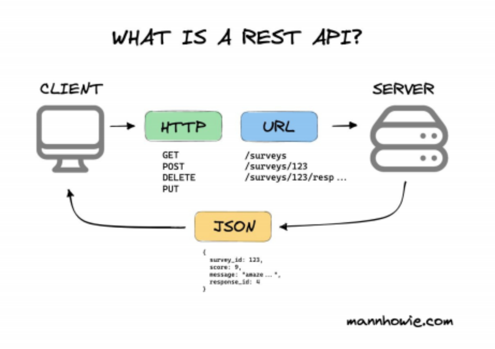
- RESTful API (or REST API): Web API conforming to the REST architecture style

### 11.2 Components

1. Resource: <b>abstraction</b> of information (调用接口)
   - Identifiers (URI including URL)
     - URL endpoint ...
   - Metadata
     - Source links (访问网址)
     - Alternate data formats (e.g. JSON, XML, ...)
     - Vary: language preferences ...
     - ...

   ``` text
   example:
      source link - `http://example.com/auther/456`
      resource    - `/auther/456`
   ```

2. Representation: <b>state</b> of the resource (返回数据)
   - Metadata
     - Media type (e.g. application/json)
     - Last-modified time
     - ...
3. Control data: interaction behavior
   - Cache-Control (200 OK, 304 Not Modified, ...)
   - ...

### 11.3 6 Guiding Principles/Constraints of REST

1. Client-Server
   - Separation of concerns
   - Modularization
   - Features
     - Portability of client
     - Scalability of serve
2. Stateless
   - No session state on server
   - Request contains all necessary info (1)
   - Requests do not rely on one another (2)
   - Features
     - Features
       - Visibility   (1)
       - Reliability  (2)
       - Scalability  (2)
     - Concern: repetitive data overhead
3. Cacheable
   - Response data should implicitly or explicitly announce cacheability
   - If cacheable, <u>client cache</u> is reused
   - Features
     - Efficiency
     - ...
   - Concern: stale data handling
4. Uniform Interface
   - <u>Principle of generality</u>
   - <b>Identification of resources</b>: uniquely identify each resource
   - <b>Manipulation of resources through representations</b>: uniform representations
   - <b>Self-descriptive messages</b>: enough info in each resource representation
   - <b>Hypermedia as the engine of application state</b>: drive resources via hyperlinks (Principles are just guidelines. It is not compulsory to follow all mentioned guidelines to become a RESTful API.)
   - Features
     - Simplicity
     - Independent evolvability
     - ...
   - Concern: degradation of efficiency (general vs. optimized)
5. Layered System
   - <u>Hierarchical layers</u>
   - Example: MVC pattern
       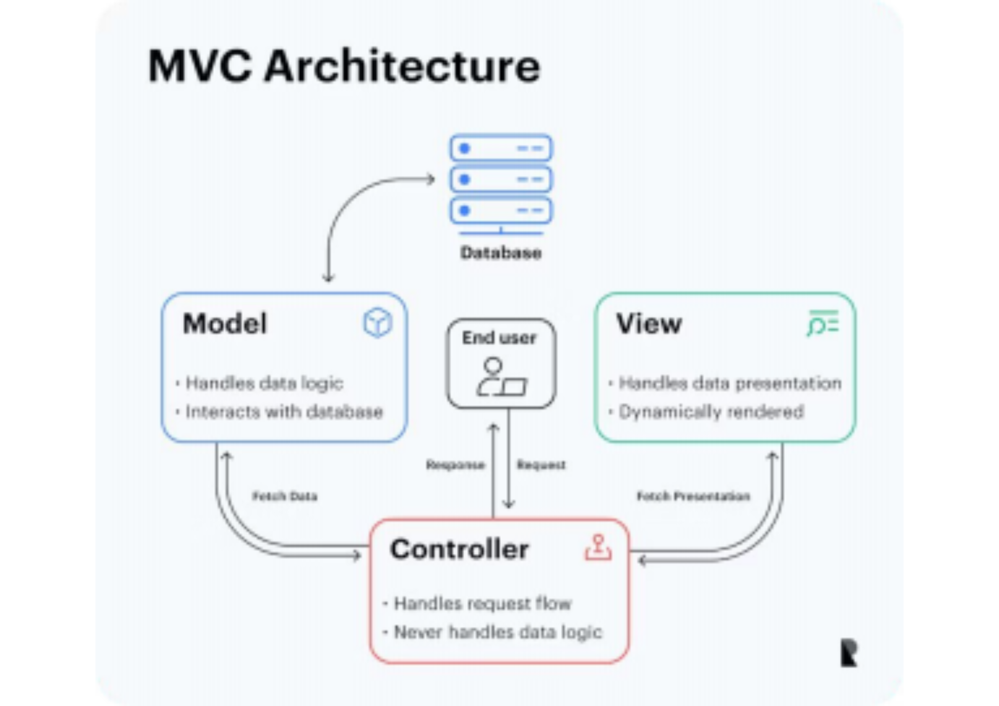
   - Features
     - Reduced coupling
       - Evolvability
       - Reusability
     - Scalability
     - Transparency
   - Concern: complexity & processing overhead
6. Code on Demand (Optional)
   - Extend client functionality by downloading code from server
   - Example: server sends JavaScript code to client to execute
   - Features
     - Simplicity of client init feature
     - Flexibility
   - Concern: visibility & security

### 11.4 RESTful API Components

Take OpenAPI specification as an example:

- Resource: identified by a URL endpoint.
- HTTP method: specifies an operation on the resource (e.g., GET, POST, etc.).
- HTTP request:
  - Header: metadata
    - Content-Type = application/json
  - Query Parameters
    - /users?age=25&sort=desc
  - Request Body
- HTTP response:
  - Status code + message
    - 200 OK
    - 404 Not Found
    - ...
  - Header
  - Response Body


### 11.5 Benefits

- Scalability
  1. <u>Client-Server</u> enables multiple server duplicates with load balancing.
  2. <u>Stateless</u> ensures that each request holds the entire context and is independently processable, thus the servers can be easily scaled out.
  3. <u>Cacheable</u> reduces the load of the servers so they can server more clients. Introducing distributed caching further improves the service capacity.
- Flexibility & Independence
  1. <u>Client-Server</u> allows the client and the server to be evolved independently without affecting each other.
  2. <u>Layered System</u> further decouples service logic so that each layer can be designed and implemented separately.
  3. Flexibility: <u>Code on Demand</u> allows the client to extend new functionalities when needed provided by the server via downloading code.
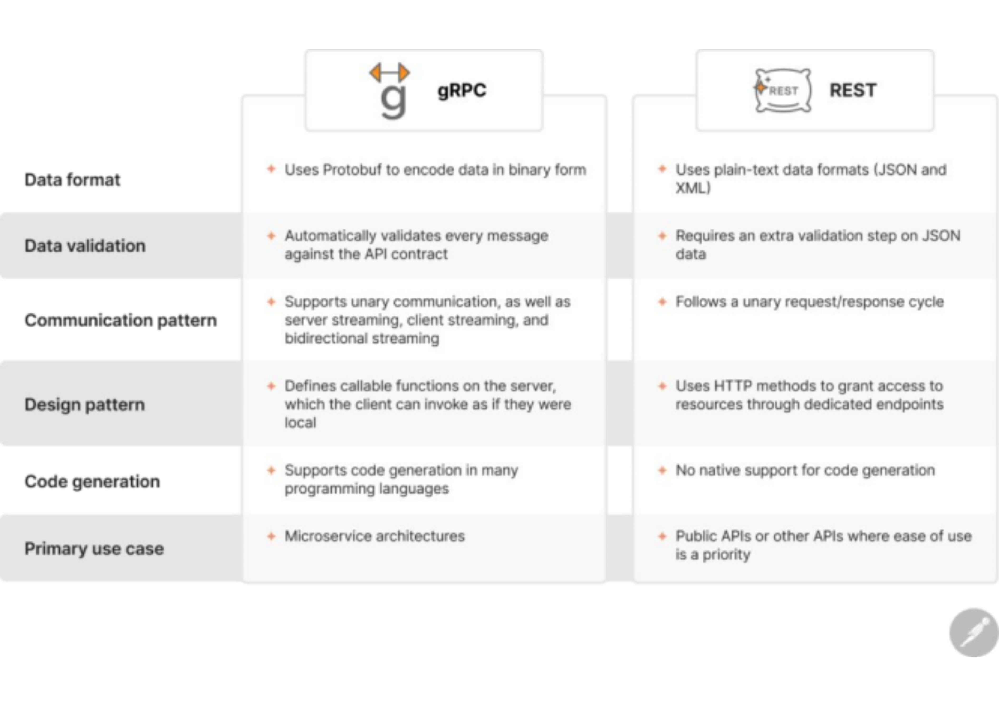

## 12 OpenAPI Specification

### 12.1 OpenAPI As a RESTful API Specification

- Refer to OpenAPI Specification
from Swagger.
- Specification document file can be either JSON or YAML.
- Metadata:
  - OpenAPI version
  - Info:
    - Title
    - API spec version
  - Tags (*)
- API paths & operations
  - URL endpoint
  - Method
  - Request & Response
- Components - Schemas
  - Set of reusable data objects

### 12.2 Benefits

- Standardization
  - Client & Server reaches an agreement on available APIs and access requirements.
- Human-Readable Format
  - JSON/YAML is both clean & programmatically operable.
- API Documentation & Visualization:
  - Swagger UI: visualize & interact with APIs in a web page
  - Swagger Editor: edit API specification file with real-time Swagger UI support
- Multi-Language Client & Server Code Template Generation:
  - Client/Server code of different frameworks from different programming languages can be automatically generated as development templates.
  - OpenAPI Generator
- Integrated Testing Capability:
  - Variable tools support easy setup for API testing.
  - cURL
  - Swagger Mock Server
  - Postman

### 12.3 Postman for RESTful API Testing

1. Download and install <u>Postman Desktop app</u>.
2. In the workspace, click the “Import” button.
3. Upload the API specification YAML file (e.g., `hello_world.yaml`). Click “Import”.
4. A collection of API testing requests will be automatically generated. Note that the URL endpoint contains a base url variable that needs to be configured.
5. Select any request in the collection, hover on the {{baseUrl}} variable in the URL endpoint and change its value to the address of the running API backend server.
6. Now play with these requests with different parameters/body

## Lab8: REVERSE PROXY + OTHER API ARCHITECTURES

## 13 Reverse Proxy

## 14 Other API Architectures

## LAB 9: HADOOP DFS & MAP-REDUCE

## 15 Introduction to hadoop

## 16 Hadoop Distributed File System (HDFS)

## 17 MapReduce: Calculating max temperature

## LAB 10: MAP-REDUCE STREAMING & INTRO TO SPARK

## 18 YARN

## 19 MapReduce Streaming

## LAB 11: APACHE SPARK

## 20 Apache Spark

## LAB 12: K8S COMPONENTS & RESOURCES

## 21 Recap: From Virtualization to K8s

## 22 Kubernetes

## LAB 13: K8S CLUSTER SETUP

## 23 Kubernetes Scheduler

## 24 Kubernetes Pod Filtering

## LAB 14: CLOUD BASICS + IAC

## 25 Cloud Computing

## 26 Infrastructure as Code
